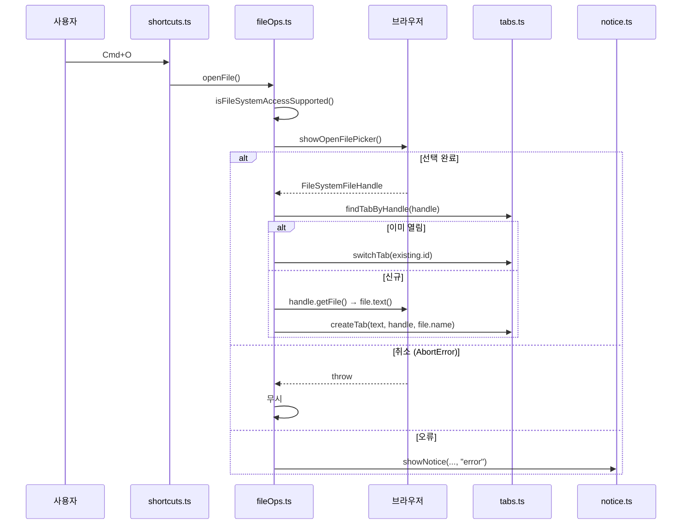
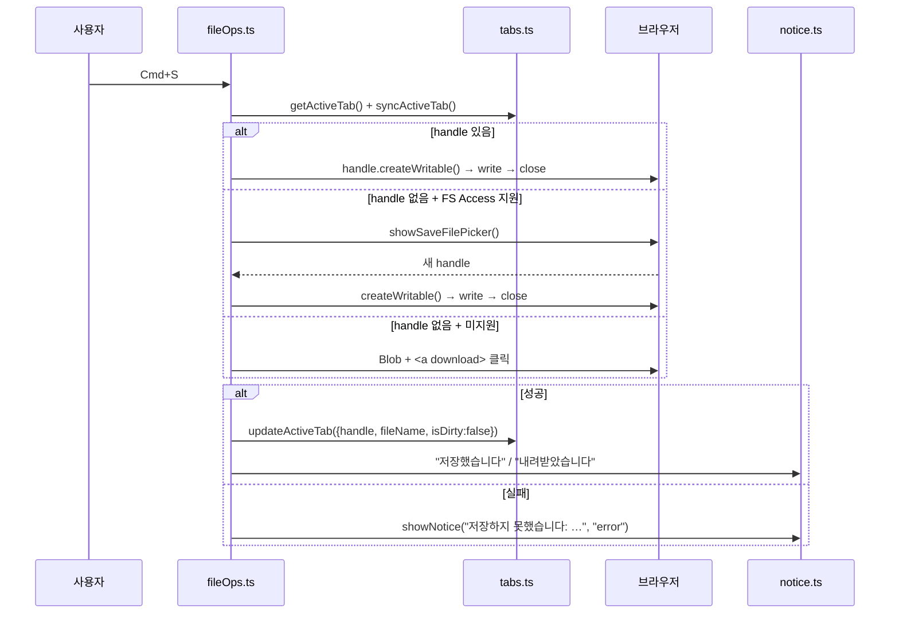

# API 명세 — 브라우저 플랫폼 API

> 최종 갱신: 2026-08-12 · 대상: 웹 전환 (v2.0.0)
> 이전 문서(`bridge-api.md`, JS↔Swift 브리지)는 네이티브 앱 제거와 함께 이 문서로 대체됐다.

## 0. HTTP API 현황

**HTTP API 가 없다.** REST/GraphQL 엔드포인트, 인증 토큰, 서버 호출이 전무하다. Cloudflare Workers 는 정적 자산만 서빙하며 앱은 최초 로드 이후 어떤 요청도 보내지 않는다.

프로세스/보안 경계를 넘는 인터페이스는 **브라우저 표준 API 3종**이다.

| 인터페이스 | 용도 | 지원 |
|-----------|------|------|
| File System Access API | 로컬 파일 열기·덮어쓰기 | Chrome·Edge |
| `<input type="file">` + Blob 다운로드 | 폴백 열기·저장 | 전 브라우저 |
| `localStorage` | 세션 자동 저장 | 전 브라우저 (시크릿 모드 예외) |
| Service Worker + Cache Storage | 오프라인 지원 | 전 최신 브라우저 (프로덕션 빌드만) |
| Web App Manifest | 설치형 PWA | 전 최신 브라우저 |

노출되는 URL 목록은 [테스트 계획 §3](../testing/test-plan.md#3-url-인벤토리) 참고.

---

## 1. 능력 탐지

```ts
export function isFileSystemAccessSupported(): boolean {
  return typeof window.showOpenFilePicker === "function"
      && typeof window.showSaveFilePicker === "function";
}
```

결과는 `document.body.dataset.fsAccess` 에 `"true"`/`"false"` 로 반영된다 (E2E·디버깅용).

> File System Access API 는 **보안 컨텍스트(HTTPS 또는 localhost)** 에서만 노출된다. LAN IP 로 접속하면 자동으로 폴백 경로가 선택된다.

---

## 2. 파일 열기

### 2.1 File System Access 경로

```ts
const [handle] = await window.showOpenFilePicker({
  types: [{
    description: "Markdown",
    accept: { "text/markdown": [".md", ".markdown"], "text/plain": [".txt"] },
  }],
  multiple: false,
});
```

| 단계 | 동작 |
|------|------|
| 1 | 핸들 획득 (사용자 제스처 필요) |
| 2 | `await findTabByHandle(handle)` — `isSameEntry()` 로 중복 검사 |
| 3 | 이미 열려 있으면 `switchTab()` 후 **조기 반환** |
| 4 | 아니면 `handle.getFile()` → `file.text()` → `createTab(text, handle, file.name)` |

| 결과 | 처리 |
|------|------|
| 성공 | 새 탭 생성 및 활성화 |
| 사용자 취소 | `AbortError` → **무시** (알림 없음) |
| 그 외 오류 | `showNotice("파일을 열지 못했습니다: …", "error")` |

### 2.2 폴백 경로

`initFileOps()` 가 숨김 `<input type="file" id="file-input" accept=".md,.markdown,.txt,text/markdown,text/plain">` 을 `document.body` 에 붙여 둔다. `openFile()` 은 이 요소를 `click()` 한다.

`change` 이벤트에서:
1. `input.value = ""` — 같은 파일을 연속 선택해도 이벤트가 발생하도록 초기화
2. `createTab(await file.text(), null, file.name)`

**제약**: 핸들이 없으므로 **중복 열기 판별이 불가능**하다. 같은 파일을 두 번 열면 탭이 2개 생긴다.

---

## 3. 파일 저장

### 3.1 `saveFile()` — 분기

```
saveFile()
 ├─ 활성 탭 없음 → return
 ├─ syncActiveTab()
 ├─ tab.handle 있음 → writeToHandle(tab.handle, ...)   // 대화상자 없이 덮어쓰기
 └─ tab.handle 없음 → saveFileAs()
```

### 3.2 `saveFileAs()` — 분기

| 조건 | 동작 |
|------|------|
| FS Access 미지원 | `downloadFile(content, suggestedName)` → `updateActiveTab({fileName, isDirty:false})` → "내려받았습니다" 알림 |
| FS Access 지원 | `showSaveFilePicker({ types, suggestedName })` → `writeToHandle(handle, content, handle.name)` |

`suggestFileName()` 규칙:

| 입력 | 출력 |
|------|------|
| `"Untitled"` 또는 공백 | `"Untitled.md"` |
| `"note.md"` / `"a.markdown"` / `"b.txt"` | 그대로 유지 |
| `"보고서"` | `"보고서.md"` |

### 3.3 `writeToHandle()`

```ts
const writable = await handle.createWritable();
await writable.write(content);
await writable.close();
updateActiveTab({ handle, fileName, isDirty: false });
showNotice(`${fileName} 에 저장했습니다.`);
```

| 결과 | 처리 |
|------|------|
| 성공 | dirty 해제 + 성공 알림 |
| `AbortError` (권한 대화상자 취소) | 무시 |
| 그 외 (권한 없음·디스크 오류) | `showNotice("저장하지 못했습니다: …", "error")` — **dirty 는 유지** |

### 3.4 폴백 다운로드

```ts
const blob = new Blob([content], { type: "text/markdown;charset=utf-8" });
const url = URL.createObjectURL(blob);
// <a download> 생성 → click → remove → revokeObjectURL
```

**제약**: 덮어쓰기 개념이 없다. 저장할 때마다 브라우저 다운로드 폴더에 새 파일이 생기며, 동일 이름이면 `note (1).md` 처럼 번호가 붙는다.

---

## 4. 세션 저장 (`localStorage`)

| 항목 | 값 |
|------|-----|
| 키 | `markdown-editor:session:v1` |
| 쓰기 시점 | 상태 변경 후 500ms 디바운스, `beforeunload`, `visibilitychange(hidden)` |
| 읽기 시점 | `initTabs()` 최초 1회 |
| 스키마 | [데이터 모델 §3](../architecture/data-model.md#3-localstorage-세션-스키마) |

접근 불가 환경(시크릿 모드 등)에서는 기동 시 8초짜리 오류 알림을 띄우고 자동 저장 없이 동작한다.

**용량 초과 처리 (F-54)**: `saveSession()` 이 `false` 를 반환하면 `persistNow()` 가 "브라우저 저장 공간이 부족해 자동 저장이 중단됐습니다" 오류 알림을 띄운다. 500ms 마다 반복되지 않도록 플래그로 1회만 알리고, 저장이 다시 성공하면 플래그를 해제한다.

---

## 4.1 Service Worker / Cache Storage

| 항목 | 값 |
|------|-----|
| 스크립트 | `/sw.js` (scope `/`) |
| 등록 조건 | `import.meta.env.PROD && "serviceWorker" in navigator` |
| 등록 시점 | `window` `load` 이벤트 |
| 캐시 이름 | `markdown-editor-<빌드 ID>` (빌드마다 달라짐) |
| 실패 처리 | `console.warn` 후 무시 — 오프라인은 부가 기능이라 앱 동작에 영향 없음 |

캐시 전략은 [서비스 아키텍처 §7.1](../architecture/service-architecture.md#71-오프라인-서비스-워커) 참고.

`/sw.js` 는 `_headers` 에서 `Cache-Control: no-cache` 로 지정한다. 서비스 워커 스크립트가 캐시되면 업데이트가 영원히 막히기 때문이다.

### 4.1.1 갱신 메시지 프로토콜 (F-69)

| 방향 | 메시지 | 트리거 | 수신 측 동작 |
|------|--------|--------|--------------|
| 페이지 → 워커 | `{ type: "SKIP_WAITING" }` | 사용자가 "새로고침" 클릭 | `self.skipWaiting()` |
| 워커 → 페이지 | (없음) | — | `controllerchange` 이벤트로 대체 |

**전송 대상은 `registration.waiting` 이다.** `navigator.serviceWorker.controller` 로 보내면 구 워커에게 가서 아무 일도 일어나지 않는다.

`install` 에서 `skipWaiting()` 을 호출하지 않으므로 새 워커는 대기 상태에 머무른다. 이것이 "대기 중인 새 버전" 을 감지할 수 있는 전제다.

### 4.1.2 감지 이벤트

| 이벤트 | 용도 | 주의 |
|--------|------|------|
| `registration.waiting` (즉시 조회) | 로드 시점에 이미 대기 중인 경우 | 1초 지연 후 표시해 초기 렌더를 방해하지 않는다 |
| `registration.updatefound` | 세션 중 새 워커 설치 시작 | `installing.state === "installed"` 까지 기다린다 |
| `serviceWorker.controllerchange` | 새 워커 활성화 완료 | **갱신 수락 시점에만 구독.** 상시 구독하면 최초 설치의 `clients.claim()` 으로도 발화한다 |
| `registration.update()` | 능동 확인 | 60분 주기 + 가시성 복귀 시(10분 스로틀) |

### 4.1.3 `swUpdate.ts` — 리프 모듈 계약

`SwUpdateHost` 로 모든 능력을 주입받아 앱 모듈을 하나도 import 하지 않는다. `notice.ts` 확장은 `tabs → notice → tabs` 순환을 만들어 기각했다.

| host 필드 | 기본 구현 | `main.ts` 주입값 |
|-----------|-----------|------------------|
| `register()` | `navigator.serviceWorker.register("/sw.js")` | 기본 |
| `onControllerChange(fn)` | `addEventListener` + 해제 함수 반환 | 기본 |
| `persist()` | `() => false` | `tabs.persistNow` |
| `hasDirty()` | `() => false` | `tabs.hasDirtyTabs` |
| `confirmUnsafeReload(msg)` | `window.confirm` | 기본 |
| `reload()` | `location.reload()` | 기본 |
| `returnFocusTo` | `null` | `editorEl` |

`isUpdateReloadPending()` 을 export 해 `main.ts` 의 `beforeunload` 가 억제 여부를 판단한다.

## 4.2 Web App Manifest

`/manifest.webmanifest` — `display: standalone`, `start_url: /`, `theme_color: #1e1e1e`, 아이콘은 `/icon.svg`(`any` + `maskable`).

---

## 5. 키보드 단축키

| 단축키 | 동작 | 비고 |
|--------|------|------|
| `Cmd/Ctrl + O` | 파일 열기 | `preventDefault()` 로 브라우저 기본 동작 차단 |
| `Cmd/Ctrl + S` | 저장 | 동일 |
| `Cmd/Ctrl + Shift + S` | 다른 이름으로 저장 | 웹 전환에서 신설 |
| `Alt + N` | 새 문서 | `Cmd/Ctrl+N` 은 브라우저가 선점 |
| `Alt + W` | 탭 닫기 | `Cmd/Ctrl+W` 는 브라우저가 선점하며 차단 불가 |

Alt 조합은 macOS 에서 `e.key` 가 특수문자로 바뀌므로 **`e.code`(`KeyN`/`KeyW`)로 판별**한다. `Cmd`/`Ctrl` 조합은 `e.key.toLowerCase()` 로 판별한다.

---

## 6. 이탈 방지

```ts
window.addEventListener("beforeunload", (e) => {
  persistNow();
  if (hasDirtyTabs()) { e.preventDefault(); e.returnValue = ""; }
});

document.addEventListener("visibilitychange", () => {
  if (document.visibilityState === "hidden") persistNow();
});
```

`beforeunload` 문구는 모든 최신 브라우저가 무시하고 자체 경고를 띄운다. 모바일 Safari 는 `beforeunload` 를 신뢰할 수 없어 `visibilitychange` 로 보강한다.

---

## 7. 전체 시퀀스

### 7.1 파일 열기 (FS Access)



### 7.2 파일 저장



---

## 8. 보안 노트

| 항목 | 상태 |
|------|------|
| XSS | ✅ **2중 방어** — `parser.ts` 의 DOMPurify 정화 + CSP `script-src 'self'` |
| 파일 접근 범위 | ✅ 사용자가 명시적으로 고른 파일만. 앱이 임의 경로를 읽을 수 없다 |
| 경로 노출 | ✅ 브라우저가 절대 경로를 숨긴다 |
| 문서 유출 | ✅ 문서가 네트워크로 전송되지 않는다 |
| localStorage 격리 | ⚠️ 같은 오리진의 다른 스크립트가 세션을 읽을 수 있다. 공유 호스팅 오리진에 배포하지 말 것 |
| CSP | ✅ `public/_headers` — `script-src 'self' + CF Insights 비콘`, `object-src 'none'`, `frame-ancestors 'none'`. [인프라 §6.1](../architecture/infrastructure.md#61-보안-헤더-public_headers) |

---

## 9. 관련 문서

- [서비스 아키텍처](../architecture/service-architecture.md)
- [데이터 모델](../architecture/data-model.md)
- [기능 ↔ 모듈 ↔ API 상호 관계](../architecture/traceability.md)
- [테스트 계획](../testing/test-plan.md)
