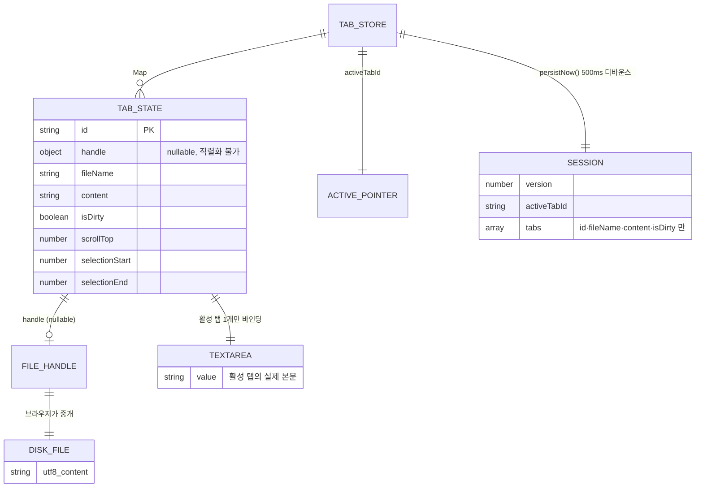
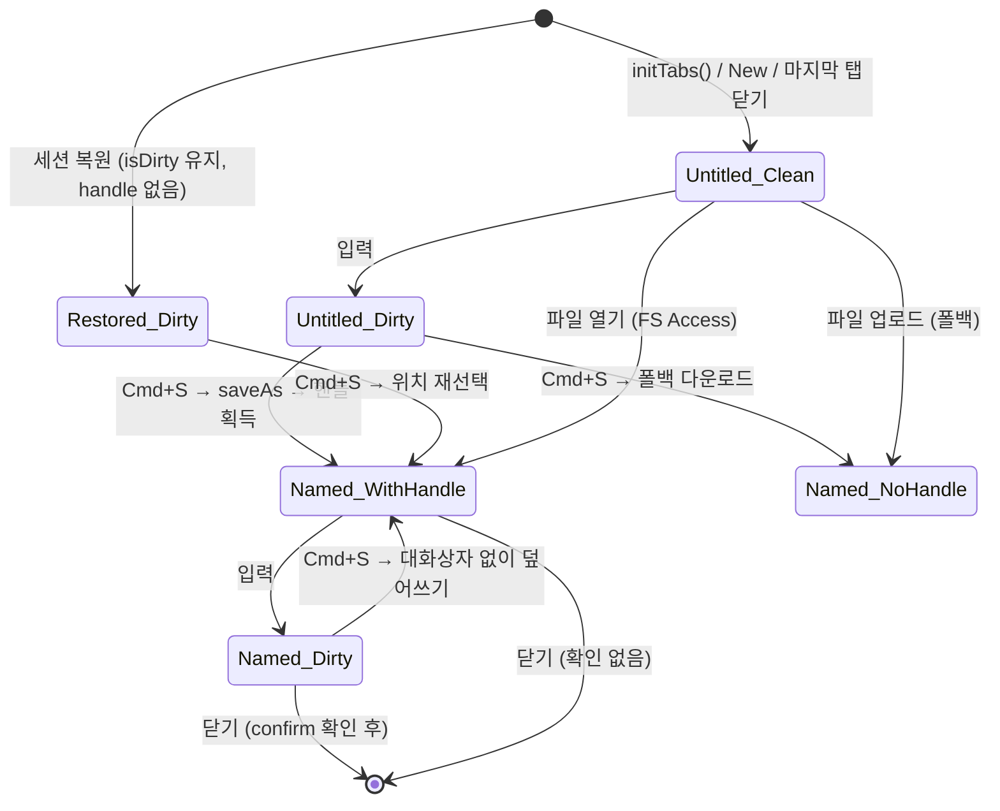

# 데이터 모델

> 최종 갱신: 2026-08-12 · 대상: 웹 전환 (v2.0.0)

## 0. 레이아웃 설정 (F-32)

| 키 | 스키마 | 손상 시 |
|----|--------|---------|
| `markdown-editor:layout:v1` | `{ ratio: number }` | `null` 반환 → 호출부가 기본값 0.5 |

**문서 세션과 별도 키인 이유**: 세션은 손상 시 통째로 버리는 정책이다. 그때 분할 비율까지 함께 날릴 이유가 없고, 반대로 비율이 깨져도 문서는 멀쩡해야 한다.

`loadSplitRatio()` 는 **타입까지 확인한다.** JSON 파싱에 성공해도 값이 문자열·객체일 수 있고, 그대로 흘려보내면 레이아웃 계산이 조용히 `NaN` 이 된다 — 예외가 나지 않아 개발 중에 드러나지 않는다.

## 1. 데이터베이스 현황

**서버 데이터베이스가 존재하지 않는다.** SQL/NoSQL, ORM, 마이그레이션, Supabase 연동 어느 것도 사용하지 않는다. 문서는 서버로 전송되지 않는다.

데이터는 세 곳에만 존재한다.

| 계층 | 저장 위치 | 수명 | 용도 |
|------|-----------|------|------|
| 런타임 상태 | `src/tabs.ts` 인메모리 `Map` | 페이지 수명 | 열린 탭 전체 |
| 세션 캐시 | `localStorage` (`markdown-editor:session:v1`) | 브라우저가 지울 때까지 | 새로고침·크래시 복원 |
| 영속 문서 | 사용자 로컬 디스크 `.md` | 영구 | 진짜 저장본 |

따라서 이 문서는 "테이블 스키마" 대신 **인메모리 상태 스키마 + localStorage 스키마 + 파일 경계**를 기술한다.

## 2. 인메모리 상태 스키마

### 2.1 저장소 (`src/tabs.ts` 모듈 스코프)

| 변수 | 타입 | 역할 |
|------|------|------|
| `tabs` | `Map<string, TabState>` | 열린 문서 전체. 삽입 순서 = 탭 바 표시 순서 |
| `activeTabId` | `string` | 현재 활성 탭 ID |
| `nextId` | `number` | ID 시퀀스. 세션 복원 시 복원된 최대값+1 로 밀어 충돌을 막는다 |
| `persistTimer` | `Timeout \| null` | 세션 저장 디바운스(500ms) |
| `onCloseDirty` | `(tab) => boolean` | dirty 탭 닫기 확인 콜백 |

### 2.2 `TabState`

| 필드 | 타입 | 기본값 | 설명 |
|------|------|--------|------|
| `id` | `string` | `tab-{n}` | PK |
| `handle` | `FileSystemFileHandle \| null` | `null` | 디스크 파일 핸들. **경로를 노출하지 않는다** |
| `fileName` | `string` | `"Untitled"` | 탭 라벨 |
| `content` | `string` | `""` | 문서 본문. **비활성 탭에서만 신뢰 가능** (§2.4) |
| `isDirty` | `boolean` | `false` | 마지막 저장 이후 변경 여부 |
| `scrollTop` | `number` | `0` | textarea 스크롤 위치 |
| `selectionStart` | `number` | `0` | 커서/선택 시작 |
| `selectionEnd` | `number` | `0` | 커서/선택 끝 |

### 2.3 `filePath` → `handle` 로의 변경

네이티브 버전의 `filePath: string | null` 은 웹에 존재하지 않는다. File System Access API 는 보안상 **절대 경로를 노출하지 않고** 불투명한 핸들만 준다. 그 결과:

| 항목 | 이전 (네이티브) | 현재 (웹) |
|------|-----------------|-----------|
| 파일 식별 | 문자열 경로 비교 | `handle.isSameEntry(other)` (**비동기**) |
| 중복 탭 탐색 | `findTabByPath()` 동기 | `findTabByHandle()` `Promise` 반환 |
| 직렬화 | JSON 가능 | **불가능** — 세션에 저장할 수 없다 |
| 폴백 브라우저 | 해당 없음 | 핸들 자체가 없어 항상 `null` |

`handle` 이 `null` 인 탭은 저장 시 항상 "위치 묻기"(`saveAs`) 경로를 탄다. 세션 복원 탭, 업로드로 연 탭, 새 문서가 여기 해당한다.

### 2.4 상태 정합성 규칙 ⚠️

**활성 탭의 `content`/`scrollTop`/`selection*` 는 실시간으로 갱신되지 않는다.**

```
활성 탭의 진짜 본문 = editorEl.value   (TabState.content 아님)
비활성 탭의 진짜 본문 = TabState.content
```

이를 안전하게 다루기 위해 `syncActiveTab()` 을 export 하고, 아래 시점에서 반드시 먼저 호출한다.

| 호출 지점 | 이유 |
|-----------|------|
| `switchTab()` 진입부 | 떠나는 탭의 스냅샷 확보 |
| `closeTab()` 진입부 | dirty 판정 전에 최신 상태 확보 |
| `persistNow()` | 세션에 최신 본문 저장 (반환값으로 성공 여부 전달) |
| `hasDirtyTabs()` | `beforeunload` 판정 |
| `saveFile()` / `saveFileAs()` | 디스크에 최신 본문 기록 |

저장 시 실제로 쓰는 값은 `getActiveContent()`(= `editorEl.value`)다.

### 2.5 관계도



## 3. localStorage 세션 스키마

**키**: `markdown-editor:session:v1` · **스키마 버전**: `1`

```ts
interface PersistedSession {
  version: number;          // 1 이 아니면 폐기
  activeTabId: string;
  tabs: PersistedTab[];     // 비면 폐기
}

interface PersistedTab {
  id: string;
  fileName: string;
  content: string;
  isDirty: boolean;
}
```

**의도적으로 저장하지 않는 것**

| 필드 | 사유 |
|------|------|
| `handle` | 구조적 복제 불가. 재방문 시 권한도 초기화된다 |
| `scrollTop` / `selection*` | 복원 가치 대비 비용이 낮아 0 으로 초기화 |

### 3.1 방어 로직 (`storage.ts`)

| 상황 | 동작 |
|------|------|
| localStorage 접근 자체가 throw (시크릿 모드·정책 차단) | `isStorageAvailable()` false → 자동 저장 비활성 + 사용자 알림 |
| JSON 파싱 실패 | `null` 반환 → 빈 Untitled 탭으로 기동 |
| `version` 불일치 | `null` 반환 |
| 개별 탭 항목의 형식 오류 | 해당 항목만 버리고 나머지 복원 |
| 남은 탭 0개 | `null` 반환 |
| `QuotaExceededError` | `saveSession()` 이 `false` 반환 → `persistNow()` 가 **사용자에게 1회 알림**(F-54). 반복 알림을 막기 위해 플래그를 두고, 저장이 다시 성공하면 해제한다 |

## 4. 상태 전이



## 5. 상태 변경 API (`tabs.ts` export)

| 함수 | 쓰기 대상 | 부수효과 |
|------|-----------|----------|
| `initTabs(tabBar, editor, preview, title)` | DOM 참조 4개 | 세션 복원 또는 기본 탭 생성 |
| `createTab(content?, handle?, fileName?)` → `id` | `tabs`, `nextId` | `switchTab(id)` |
| `switchTab(id)` | 이전 탭 스냅샷, `activeTabId`, textarea | focus 복원 → 선택 복원 → 프리뷰·탭바·타이틀·세션 |
| `closeTab(id)` | `tabs` | dirty 면 확인 콜백. 마지막 탭이면 새 Untitled 생성 |
| `syncActiveTab()` | 활성 `TabState` | 없음 |
| `getActiveTab()` / `getAllTabs()` | — | 읽기 전용 |
| `getActiveContent()` | — | `editorEl.value` 반환 |
| `hasDirtyTabs()` | 활성 탭 동기화 | `beforeunload` 판정용 |
| `markActiveTabDirty()` | `isDirty` | 세션 저장 예약 |
| `findTabByHandle(handle)` → `Promise` | — | `isSameEntry()` 선형 탐색 |
| `updateActiveTab(partial)` | `handle`/`fileName`/`isDirty`/`content` | 탭바·타이틀·세션 |
| `persistNow()` → `boolean` | localStorage | 디바운스 무시하고 즉시 저장. **반환값은 `saveSession()` 성공 여부**(F-69). 갱신 흐름이 이탈 경고 억제를 안전하게 판단하려면 저장 성공 여부를 알아야 한다. 기존 호출부 3곳은 반환값을 쓰지 않아 무영향 |
| `setCloseConfirm(fn)` | `onCloseDirty` | — |

## 6. 영속 계층 (로컬 디스크)

| 항목 | 값 |
|------|-----|
| 인코딩 | UTF-8 (`File.text()` / `FileSystemWritableFileStream.write()`) |
| 열기 필터 | `.md`, `.markdown`, `.txt` |
| 저장 기본 파일명 | `Untitled.md` (기존 이름이 있으면 확장자 보정 후 유지) |
| 덮어쓰기 | Chrome·Edge 만 가능 |
| 자동 저장(디스크) | **없음** — localStorage 자동 저장과 혼동 주의 |
| 외부 변경 감지 | **없음** |

## 7. 관련 문서

- [브라우저 API 명세](../api/browser-apis.md) — 상태 ↔ 디스크 경계
- [기능 ↔ 모듈 ↔ 상태 상호 관계](./traceability.md)
- [서비스 아키텍처](./service-architecture.md)
