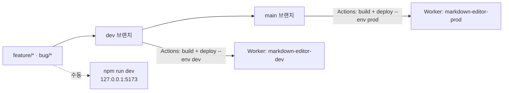
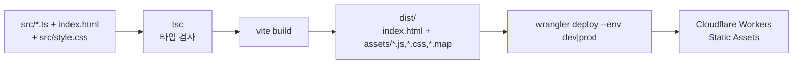

# 인프라 아키텍처

> 최종 갱신: 2026-08-12 · 대상: 웹 전환 (v2.0.0)

## 1. 인프라 요약

| 항목 | 상태 |
|------|------|
| 호스팅 | **Cloudflare Workers** (정적 자산 전용, 서버 로직 없음) |
| 환경 | local / dev / prod 3종 |
| 애플리케이션 서버 | 없음 |
| 데이터베이스 | 없음 ([데이터 모델](./data-model.md)) |
| 런타임 외부 API 호출 | 없음 |
| CI/CD | GitHub Actions (`.github/workflows/ci.yml` — verify → deploy 의존 잡) |
| 시크릿 | `CLOUDFLARE_API_TOKEN`, `CLOUDFLARE_ACCOUNT_ID` 2개뿐 |
| 배포 산출물 | `dist/` (HTML + JS + CSS + sourcemap) |

이전 버전의 macOS 네이티브 앱(Xcode 프로젝트, `build.sh`, DMG, `app://` 스킴)은 웹 전환과 함께 전부 제거했다.

## 2. 환경 매트릭스

| 환경 | 소스 브랜치 | 배포 방식 | Worker 이름 | `APP_ENV` | 접근 |
|------|-------------|-----------|-------------|-----------|------|
| **local** | 작업 브랜치 | `npm run dev` (Vite) 또는 `npm run cf:dev` (workerd) | — | — | `http://127.0.0.1:5173` |
| **dev** | `dev` | `dev` push 시 GitHub Actions 자동 | `markdown-editor-dev` | `dev` | `*.workers.dev` |
| **prod** | `main` | `main` push 시 GitHub Actions 자동 | `markdown-editor-prod` | `prod` | **`md-editor.devworld.co.kr`** |



**local 환경 주의**: 이 앱은 외부 서비스에 의존하지 않으므로 로컬에서도 전 기능이 동작한다. 단 File System Access API 는 **보안 컨텍스트(HTTPS 또는 localhost)** 를 요구한다. `127.0.0.1`/`localhost` 는 보안 컨텍스트로 취급되지만 LAN IP(`192.168.x.x`)로 접속하면 파일 열기/저장이 폴백 경로로 떨어진다.

## 3. 빌드 파이프라인



### 3.1 Vite 설정 (`vite.config.ts`)

```ts
base: "/"            // 사이트 루트 서빙
build.outDir: "dist"
build.sourcemap: true  // 프로덕션 디버깅용
```

네이티브 시절의 `base: "./"`, `crossOriginLoading: false`, `modulePreload: false` 는 `app://` 커스텀 스킴 호환을 위한 것이었으므로 모두 제거했다.

### 3.2 정적 자산 (`public/`)

`public/` 의 내용은 vite 가 `dist/` 루트로 그대로 복사한다.

| 파일 | 용도 |
|------|------|
| `_headers` | Cloudflare Workers 응답 헤더 규칙 (CSP·캐시) — §6.1 |
| `manifest.webmanifest` | PWA 매니페스트 |
| `icon.svg` | 파비콘 + PWA 아이콘 |
| `sw.js` | 서비스 워커 (오프라인 캐시 + 갱신 알림 프로토콜) |

**빌드 ID 주입 (F-69)**: `vite.config.ts` 의 `swBuildIdPlugin` 이 `writeBundle` 훅에서 `dist/sw.js` 의 `__BUILD_ID__` 를 빌드마다 달라지는 값으로 치환한다. vite 는 `public/` 을 변환 없이 복사만 하므로 `transform` 훅이 닿지 않아 복사 이후 단계가 필요하다.

이 치환이 없으면 `/sw.js` 응답 바이트가 배포마다 동일해 브라우저가 업데이트를 감지하지 못하고 **갱신 알림이 한 번도 뜨지 않는다.** 실패 모드가 조용한 무동작이라, 플레이스홀더를 못 찾으면 **빌드를 실패시킨다.** 값은 `GITHUB_SHA` → `CF_PAGES_COMMIT_SHA` → `Date.now().toString(36)` 순으로 결정된다.

> `_headers` 와 서비스 워커는 **개발 서버에서 동작하지 않는다.** `_headers` 는 Cloudflare 가 적용하고, 서비스 워커는 `import.meta.env.PROD` 일 때만 등록한다. 관련 E2E 는 원격 baseURL 일 때만 실행된다.

### 3.2.1 E2E 실행 모드

`playwright.config.ts` 는 `E2E_PREVIEW=1` 일 때 개발 서버 대신 `build && preview`(프로덕션 번들)를 띄운다. 서비스 워커가 `import.meta.env.PROD` 에서만 등록되기 때문에 F-69 시나리오는 이 모드에서만 유효하다. 기본(개발 서버) 실행 동작은 바뀌지 않는다.

### 3.3 타입 검사와 번들의 분리

`npm run build` 는 `tsc --noEmit && vite build` 다. 번들링은 vite 가 전담하고 `tsc` 는 타입 검사만 한다.

이전 설정(`outDir: dist`, `declaration: true`)은 `tsc` 가 `dist/` 에 `.js`/`.d.ts` 를 쏟아낸 뒤 `vite build` 가 덮어쓰는 구조였다. 평소에는 vite 가 `dist/` 를 비우고 시작해 문제가 없지만, **`tsc` 가 타입 오류로 멈추면 중간 산출물이 `dist/` 에 그대로 남는다.** 실제로 PWA 작업 중 이 상태를 만났다.

### 3.4 Wrangler 설정 (`wrangler.jsonc`)

```jsonc
{
  "name": "markdown-editor",
  "compatibility_date": "2026-08-12",
  "assets": {
    "directory": "./dist",
    "not_found_handling": "single-page-application"
  },
  "env": {
    "dev":  { "name": "markdown-editor-dev",  "vars": { "APP_ENV": "dev" }  },
    "prod": {
      "name": "markdown-editor-prod",
      "vars": { "APP_ENV": "prod" },
      "routes": [{ "pattern": "md-editor.devworld.co.kr", "custom_domain": true }]
    }
  }
}
```

`main` 엔트리가 없는 **정적 자산 전용 Worker**다. 서버 코드를 실행하지 않으므로 요청당 비용이 사실상 없고 콜드 스타트도 없다.

`not_found_handling: "single-page-application"` 은 알 수 없는 경로를 `index.html` 로 되돌린다. 현재 앱은 라우팅이 없으므로 실질 효과는 "어떤 경로로 들어와도 에디터가 뜬다" 이다.

검증: `npx wrangler deploy --env dev --dry-run` (배포 없이 설정·번들 확인).

## 3.9 PWA 아이콘 생성 (F-68)

`public/icon.svg` 에서 PNG 4종을 만든다. **산출물은 저장소에 커밋되고 빌드 시점에는 생성하지 않는다** — CI 에 이미지 툴체인을 요구하지 않기 위해서다. 아이콘을 바꿨을 때만 `npm run icons` 를 돌린다.

| 파일 | 크기 | 형태 | 용도 |
|------|------|------|------|
| `apple-touch-icon.png` | 180 | full-bleed | iOS 홈 화면 |
| `icon-192.png` | 192 | 둥근 모서리 | `purpose: any` |
| `icon-512.png` | 512 | 둥근 모서리 | `purpose: any` |
| `icon-maskable-512.png` | 512 | full-bleed | `purpose: maskable` |

**full-bleed 와 둥근 모서리를 나누는 이유**: iOS 와 maskable 소비자는 **자기 마스크를 덧씌운다.** 이미 둥근 이미지를 주면 모서리가 두 번 깎여 이음매가 보인다. 반대로 `purpose: any` 는 마스크가 없으므로 이미지 자체가 둥글어야 한다. 기존 매니페스트는 같은 SVG 를 `any` 와 `maskable` 양쪽에 선언해 이 구분이 없었다.

**iOS 는 `apple-touch-icon` 에 SVG 를 지원하지 않는다.** PNG 가 없으면 홈 화면 추가 시 아이콘 대신 **페이지 스크린샷**이 쓰인다.

### 왜 직접 래스터화하는가

`sips`(macOS 전용)·`rsvg-convert`(시스템 설치)·`sharp`(네이티브 의존성) 중 무엇을 골라도 이식성이나 의존성 성질을 잃는다. 이 저장소의 런타임 의존성은 `marked`·`DOMPurify` 둘뿐이고, 아이콘 하나 때문에 그 성질을 포기할 이유가 없다.

이 아이콘은 **둥근 사각형 + 직선 폴리곤**뿐이라 정확한 기하 판정이 가능하다. 베지어도 그라디언트도 없으므로 범용 SVG 렌더러가 필요 없다. 4×4 슈퍼샘플링 후 `node:zlib` 로 PNG(RGBA, 필터 None)를 인코딩한다.

### 파서는 좁고, 벗어나면 멈춘다

지원 범위는 `<rect rx>` 1개 + 직선 명령(`M/L/H/V/Z`)만 쓰는 `<path>` 1개다. 곡선이나 도형 추가를 만나면 **조용히 틀린 그림을 내는 대신 예외로 멈춘다.**

> 이 가드는 처음에 헛돌았다. 토크나이저가 지원 문자만 매칭해서 `C` 를 **아예 버렸고**, 그 결과 곡선이 직선으로 파싱되어 가드가 한 번도 실행되지 않았다. 모든 알파벳을 토큰으로 잡은 뒤에야 실제로 멈춘다. **가드를 넣었으면 그 가드가 실제로 걸리는지 확인해야 한다.**

## 4. CI/CD

CI 와 CD 는 `.github/workflows/ci.yml` 한 파일의 **두 잡**이다. `deploy` 는 `needs: verify` 로 묶여 있어 **검증을 통과한 커밋만 배포된다.**

### 4.1 `verify` 잡

`pull_request` 와 `dev`/`main` push 에서 실행:

1. `npm ci`
2. `npm run build` — **타입 검사 포함** (`tsc && vite build`)
3. `npm run test:coverage` — 단위 테스트 + 커버리지
4. `npx playwright install --with-deps chromium`
5. `npm run test:e2e` — E2E 73건
6. 실패 시 `playwright-report/` 아티팩트 업로드 (7일 보관)

### 4.2 `deploy` 잡

`needs: verify` + `if: github.event_name == 'push'` — PR 에서는 실행되지 않는다.

| 브랜치 | GitHub Environment | 명령 |
|--------|--------------------|------|
| `dev` | `dev` | `npx wrangler deploy --env dev` |
| `main` | `prod` | `npx wrangler deploy --env prod` |

`CLOUDFLARE_API_TOKEN` / `CLOUDFLARE_ACCOUNT_ID` 시크릿을 env 로 주입한다.

### 4.2.1 배포 헬스체크 (F-64, `scripts/healthcheck.sh`)

`wrangler deploy` 직후 같은 `deploy` 잡에서 `scripts/healthcheck.sh <URL> <GITHUB_SHA 앞 7자리>` 를 실행한다. 워크플로 인라인이 아니라 별도 스크립트로 뺀 이유는 로컬에서도 배포 없이 그대로 재현·수동 실행할 수 있어야 하기 때문이다 (`npm run healthcheck:dev` / `npm run healthcheck:prod`).

검증 항목:

1. `GET /` → 200 + `text/html` + `Content-Security-Policy` 헤더 존재
2. HTML 이 참조하는 `/assets/*.js`, `*.css` → 각각 200
3. `GET /sw.js` 의 `VERSION` — 플레이스홀더(`__BUILD_ID__`) 가 아니어야 하고, `GITHUB_SHA` 앞 7자리와 일치해야 한다 (§3.1 `swBuildIdPlugin` 참고). SHA 불일치는 "옛 배포를 보고 성공 판정"하는 사고를 막기 위한 검사다.

두 가지 실측 함정(이슈 #15 배경)을 반영한다:

- **캐시 우회** — 모든 요청에 `?cb=<타임스탬프>-<난수>` 캐시 버스팅 쿼리를 붙인다. 배포 직후 엣지 캐시(`cf-cache-status: HIT`)가 구버전을 돌려주는 것을 CSP 배포(PR #5)와 F-69 dev 배포에서 각각 실측했다.
- **재시도** — 개별 요청이 아니라 검증 시퀀스 전체를 최대 12회(기본 5초 간격, 총 약 1분)까지 재시도한다. 첫 prod 커스텀 도메인 생성 시 관측된 약 1분간의 500(엣지 인증서 프로비저닝)을 흡수하기 위함이다. 실패 사유가 전파 지연인지 실제 회귀인지 스크립트 단계에서는 구분할 수 없으므로, 마지막 시도의 실패 사유만 로그에 남기고 워크플로를 실패시킨다.

**의도적으로 넣지 않은 것**

- **prod smoke E2E 연동** — `tests/e2e/hardening.spec.ts` 를 `E2E_BASE_URL` 로 배포 환경에 대해 돌리는 방법은 이미 있지만(`urls.spec.ts` 는 로컬 개발 서버 전용이라 제외), `deploy` 잡에 붙이지 않았다. 브라우저 기동 비용까지 더해져 모든 배포가 느려지는 대가가, curl 기반 헬스체크로 이미 잡히는 회귀(F-69 플레이스홀더, CSP 헤더 누락, 자산 404)와 겹친다. 필요하면 별도 워크플로/수동 트리거로 분리하는 편이 낫다.
- **자동 롤백** — 실패 시 워크플로를 실패시키고 로그만 남긴다. Cloudflare Workers 에 대한 자동 롤백은 별도 API 호출과 상태 판단 로직이 필요해 복잡도·오작동(일시적 전파 지연을 회귀로 오판해 롤백) 위험이 재시도로 얻는 이득보다 크다고 판단했다. 롤백은 여전히 §6 의 수동 절차(Cloudflare 대시보드 이전 버전 배포 또는 `main` revert)를 따른다.

### 4.3 CI 환경 제약 (실패로 확인한 것)

| 제약 | 이유 |
|------|------|
| **Node 24 사용** (20 불가) | `jsdom@30` → `undici@8` 의 engines 가 `>=22.19.0`. Node 20 에서는 `webidl.util.markAsUncloneable` 부재로 vitest 워커가 기동조차 못 한다. `package.json` `engines` 에 `>=22.22.2` 로 명시 |
| **`cloudflare/wrangler-action` 미사용** | 액션이 번들한 wrangler 3.90 은 `wrangler.jsonc`(JSON 설정)를 읽지 못해 `env`·`assets` 를 통째로 무시하고 "Missing entry-point" 로 실패한다. package-lock 에 고정된 wrangler 4 를 `npx` 로 직접 호출 |

## 5. 요구 사양

| 항목 | 버전 |
|------|------|
| Node.js | 18+ (CI 는 20) |
| TypeScript | ^5.9.3 |
| Vite | ^7.3.1 |
| Vitest | ^4.0.18 (+ `@vitest/coverage-v8`, `jsdom`) |
| Playwright | ^1.62.1 |
| Wrangler | ^4.121.0 |
| marked | ^17.0.3 |
| dompurify | ^3.4.13 |

브라우저: Chromium 계열 · Firefox · Safari 최신 2개 버전. 파일 기능 차이는 [서비스 아키텍처 §6](./service-architecture.md#6-브라우저-지원-매트릭스) 참고.

## 6. 보안 · 운영 고려사항

| 항목 | 상태 |
|------|------|
| 문서 데이터 유출 | 문서가 서버로 전송되지 않으므로 서버 측 유출 경로가 없다 |
| XSS | `parser.ts` 에서 DOMPurify 로 정화. 웹 배포 시 필수 방어선 |
| HTTPS | Cloudflare 가 기본 제공. File System Access API 요구 조건도 충족 |
| CSP 헤더 | ✅ `public/_headers` — `default-src 'self'`, `object-src 'none'`, `frame-ancestors 'none'` 등 |
| 커스텀 도메인 | ✅ prod = `md-editor.devworld.co.kr` (dev 는 `*.workers.dev`) |
| 관측 | `observability.enabled = true` (Workers Logs) |
| 롤백 | Cloudflare 대시보드의 이전 버전 배포 또는 `main` revert 후 재배포 |

## 6.1 보안 헤더 (`public/_headers`)

| 헤더 | 값 |
|------|-----|
| `Content-Security-Policy` | `default-src 'self'; script-src 'self' https://static.cloudflareinsights.com; worker-src 'self'; style-src 'self' 'unsafe-inline'; img-src 'self' data: https:; font-src 'self' data:; connect-src 'self' https://cloudflareinsights.com; manifest-src 'self'; object-src 'none'; frame-src 'none'; frame-ancestors 'none'; base-uri 'self'; form-action 'none'; upgrade-insecure-requests` |
| `X-Content-Type-Options` | `nosniff` |
| `Referrer-Policy` | `no-referrer` |
| `X-Frame-Options` | `DENY` |
| `Cross-Origin-Opener-Policy` | `same-origin` |
| `Permissions-Policy` | geolocation·microphone·camera·payment·usb 전부 차단 |

**완화 항목과 사유**

| 지시어 | 완화 | 사유 |
|--------|------|------|
| `style-src` | `'unsafe-inline'` 허용 | 마크다운 본문의 인라인 `style` 속성(DOMPurify 가 허용)이 렌더되려면 필요. 인라인 스크립트와 달리 실행 권한이 없어 위험도가 낮다 |
| `img-src` | `https:` 허용 | 문서의 `` 외부 이미지 |
| `img-src` | `data:` 허용 | 인라인 SVG·data URI 이미지 |
| `script-src` | `https://static.cloudflareinsights.com` 허용 | Cloudflare Web Analytics 가 **커스텀 도메인에만** 비콘을 엣지 주입한다. `*.workers.dev`(dev)에는 주입되지 않아 dev 검증에서 드러나지 않았고, prod E2E 에서 처음 잡혔다. 차단하면 모든 사용자 콘솔에 CSP 위반 에러가 남는다 |
| `connect-src` | `https://cloudflareinsights.com` 허용 | 위 비콘의 전송 대상 |

`script-src` 는 `'self'` + Cloudflare Insights 비콘 호스트만 허용하며 `'unsafe-inline'`·`'unsafe-eval'` 은 절대 넣지 않는다. E2E 가 허용 호스트 목록을 **정확히 일치**로 단언하므로, 외부 스크립트를 추가하려면 테스트도 함께 고쳐야 한다.

**캐시 규칙**

| 경로 | `Cache-Control` | 사유 |
|------|-----------------|------|
| `/assets/*` | `public, max-age=31536000, immutable` | 콘텐츠 해시가 붙어 내용이 바뀌지 않는다 |
| `/`, `/index.html` | `no-cache` | 새 배포가 즉시 반영돼야 한다 |
| `/sw.js` | `no-cache` | 캐시되면 서비스 워커 업데이트가 영원히 막힌다 |

## 7. 개선 권고

1. **dev 환경 커스텀 도메인** — dev 는 아직 `*.workers.dev` 다. 필요하면 `md-editor-dev.devworld.co.kr` 등을 추가한다.
2. ~~**배포 후 헬스체크**~~ — §4.2.1(`scripts/healthcheck.sh`)로 완료 (F-64, 이슈 #15).
3. **서비스 워커 업데이트 알림** — 새 배포가 있어도 사용자가 알 수 없다.
4. ~~**버전 표기**~~ — `/sw.js` 의 `VERSION` 이 커밋 SHA 앞 7자리다(§3.1, §4.2.1). `APP_ENV` 외 화면 노출 버전 표기는 여전히 미구현.
5. **prod smoke E2E 자동화** — §4.2.1 에서 의도적으로 보류. 필요성이 커지면 별도 워크플로(수동 트리거 또는 배포 후 비동기 잡)로 분리 검토.

## 8. 관련 문서

- [서비스 아키텍처](./service-architecture.md)
- [Cloudflare Workers 구성](../operations/cloudflare-workers.md)
- [환경 변수 정리](../operations/environment-variables.md)
- [브랜치 전략](../operations/branch-strategy.md)
