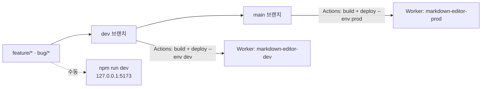
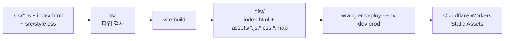

# 인프라 아키텍처

> 최종 갱신: 2026-08-12 · 대상: 웹 전환 (v2.0.0)

## 1. 인프라 요약

| 항목 | 상태 |
|------|------|
| 호스팅 | **Cloudflare Workers** (정적 자산 전용, 서버 로직 없음) |
| 환경 | local / dev / prod 3종 |
| 애플리케이션 서버 | 없음 |
| 데이터베이스 | 없음 ([데이터 모델](./data-model.md)) |
| 런타임 외부 API 호출 | 없음 |
| CI/CD | GitHub Actions (`.github/workflows/ci.yml` — verify → deploy 의존 잡) |
| 시크릿 | `CLOUDFLARE_API_TOKEN`, `CLOUDFLARE_ACCOUNT_ID` 2개뿐 |
| 배포 산출물 | `dist/` (HTML + JS + CSS + sourcemap) |

이전 버전의 macOS 네이티브 앱(Xcode 프로젝트, `build.sh`, DMG, `app://` 스킴)은 웹 전환과 함께 전부 제거했다.

## 2. 환경 매트릭스

| 환경 | 소스 브랜치 | 배포 방식 | Worker 이름 | `APP_ENV` | 접근 |
|------|-------------|-----------|-------------|-----------|------|
| **local** | 작업 브랜치 | `npm run dev` (Vite) 또는 `npm run cf:dev` (workerd) | — | — | `http://127.0.0.1:5173` |
| **dev** | `dev` | `dev` push 시 GitHub Actions 자동 | `markdown-editor-dev` | `dev` | `*.workers.dev` |
| **prod** | `main` | `main` push 시 GitHub Actions 자동 | `markdown-editor-prod` | `prod` | **`md-editor.devworld.co.kr`** |



**local 환경 주의**: 이 앱은 외부 서비스에 의존하지 않으므로 로컬에서도 전 기능이 동작한다. 단 File System Access API 는 **보안 컨텍스트(HTTPS 또는 localhost)** 를 요구한다. `127.0.0.1`/`localhost` 는 보안 컨텍스트로 취급되지만 LAN IP(`192.168.x.x`)로 접속하면 파일 열기/저장이 폴백 경로로 떨어진다.

## 3. 빌드 파이프라인



### 3.1 Vite 설정 (`vite.config.ts`)

```ts
base: "/"            // 사이트 루트 서빙
build.outDir: "dist"
build.sourcemap: true  // 프로덕션 디버깅용
```

네이티브 시절의 `base: "./"`, `crossOriginLoading: false`, `modulePreload: false` 는 `app://` 커스텀 스킴 호환을 위한 것이었으므로 모두 제거했다.

### 3.2 Wrangler 설정 (`wrangler.jsonc`)

```jsonc
{
  "name": "markdown-editor",
  "compatibility_date": "2026-08-12",
  "assets": {
    "directory": "./dist",
    "not_found_handling": "single-page-application"
  },
  "env": {
    "dev":  { "name": "markdown-editor-dev",  "vars": { "APP_ENV": "dev" }  },
    "prod": {
      "name": "markdown-editor-prod",
      "vars": { "APP_ENV": "prod" },
      "routes": [{ "pattern": "md-editor.devworld.co.kr", "custom_domain": true }]
    }
  }
}
```

`main` 엔트리가 없는 **정적 자산 전용 Worker**다. 서버 코드를 실행하지 않으므로 요청당 비용이 사실상 없고 콜드 스타트도 없다.

`not_found_handling: "single-page-application"` 은 알 수 없는 경로를 `index.html` 로 되돌린다. 현재 앱은 라우팅이 없으므로 실질 효과는 "어떤 경로로 들어와도 에디터가 뜬다" 이다.

검증: `npx wrangler deploy --env dev --dry-run` (배포 없이 설정·번들 확인).

## 4. CI/CD

CI 와 CD 는 `.github/workflows/ci.yml` 한 파일의 **두 잡**이다. `deploy` 는 `needs: verify` 로 묶여 있어 **검증을 통과한 커밋만 배포된다.**

### 4.1 `verify` 잡

`pull_request` 와 `dev`/`main` push 에서 실행:

1. `npm ci`
2. `npm run build` — **타입 검사 포함** (`tsc && vite build`)
3. `npm run test:coverage` — 단위 테스트 + 커버리지
4. `npx playwright install --with-deps chromium`
5. `npm run test:e2e` — E2E 73건
6. 실패 시 `playwright-report/` 아티팩트 업로드 (7일 보관)

### 4.2 `deploy` 잡

`needs: verify` + `if: github.event_name == 'push'` — PR 에서는 실행되지 않는다.

| 브랜치 | GitHub Environment | 명령 |
|--------|--------------------|------|
| `dev` | `dev` | `npx wrangler deploy --env dev` |
| `main` | `prod` | `npx wrangler deploy --env prod` |

`CLOUDFLARE_API_TOKEN` / `CLOUDFLARE_ACCOUNT_ID` 시크릿을 env 로 주입한다.

### 4.3 CI 환경 제약 (실패로 확인한 것)

| 제약 | 이유 |
|------|------|
| **Node 24 사용** (20 불가) | `jsdom@30` → `undici@8` 의 engines 가 `>=22.19.0`. Node 20 에서는 `webidl.util.markAsUncloneable` 부재로 vitest 워커가 기동조차 못 한다. `package.json` `engines` 에 `>=22.22.2` 로 명시 |
| **`cloudflare/wrangler-action` 미사용** | 액션이 번들한 wrangler 3.90 은 `wrangler.jsonc`(JSON 설정)를 읽지 못해 `env`·`assets` 를 통째로 무시하고 "Missing entry-point" 로 실패한다. package-lock 에 고정된 wrangler 4 를 `npx` 로 직접 호출 |

## 5. 요구 사양

| 항목 | 버전 |
|------|------|
| Node.js | 18+ (CI 는 20) |
| TypeScript | ^5.9.3 |
| Vite | ^7.3.1 |
| Vitest | ^4.0.18 (+ `@vitest/coverage-v8`, `jsdom`) |
| Playwright | ^1.62.1 |
| Wrangler | ^4.121.0 |
| marked | ^17.0.3 |
| dompurify | ^3.4.13 |

브라우저: Chromium 계열 · Firefox · Safari 최신 2개 버전. 파일 기능 차이는 [서비스 아키텍처 §6](./service-architecture.md#6-브라우저-지원-매트릭스) 참고.

## 6. 보안 · 운영 고려사항

| 항목 | 상태 |
|------|------|
| 문서 데이터 유출 | 문서가 서버로 전송되지 않으므로 서버 측 유출 경로가 없다 |
| XSS | `parser.ts` 에서 DOMPurify 로 정화. 웹 배포 시 필수 방어선 |
| HTTPS | Cloudflare 가 기본 제공. File System Access API 요구 조건도 충족 |
| CSP 헤더 | **미설정** — `_headers` 파일로 추가 권장 |
| 커스텀 도메인 | ✅ prod = `md-editor.devworld.co.kr` (dev 는 `*.workers.dev`) |
| 관측 | `observability.enabled = true` (Workers Logs) |
| 롤백 | Cloudflare 대시보드의 이전 버전 배포 또는 `main` revert 후 재배포 |

## 7. 개선 권고

1. **CSP `_headers` 추가** — `script-src 'self'` 등으로 DOMPurify 를 우회하는 잔여 위험까지 차단.
2. **dev 환경 커스텀 도메인** — dev 는 아직 `*.workers.dev` 다. 필요하면 `md-editor-dev.devworld.co.kr` 등을 추가한다.
3. **배포 후 헬스체크** — 배포 잡에 `curl` 스모크 체크 또는 prod smoke E2E 를 추가.
4. **PWA(오프라인 설치)** — 서비스 워커 + manifest 로 "설치형 웹앱" 을 제공하면 제거한 네이티브 앱의 사용성을 상당 부분 대체할 수 있다.
5. **버전 표기** — `APP_ENV` 외에 커밋 SHA 를 빌드 타임에 주입하면 배포 추적이 쉬워진다.

## 8. 관련 문서

- [서비스 아키텍처](./service-architecture.md)
- [Cloudflare Workers 구성](../operations/cloudflare-workers.md)
- [환경 변수 정리](../operations/environment-variables.md)
- [브랜치 전략](../operations/branch-strategy.md)
