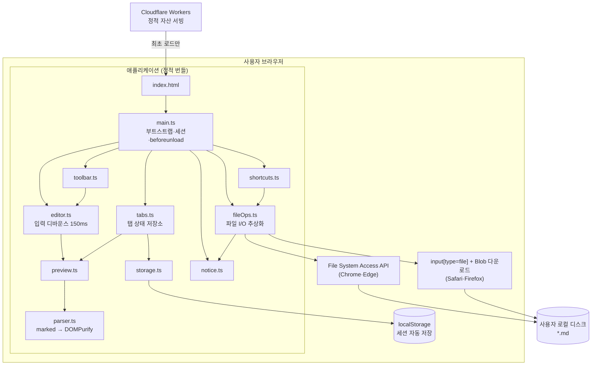
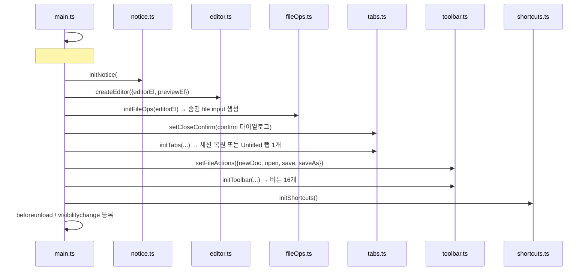
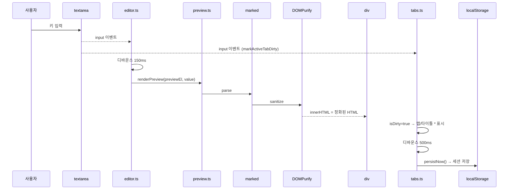
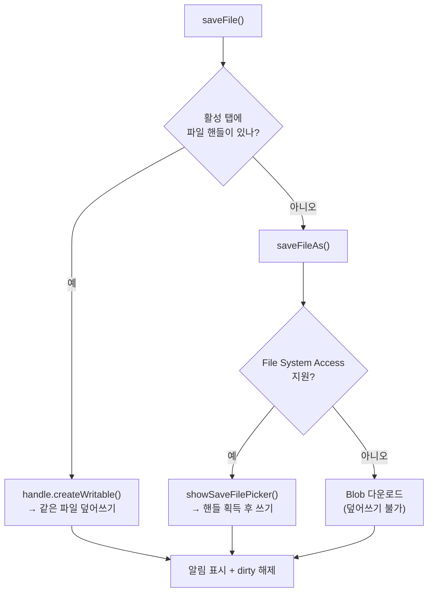
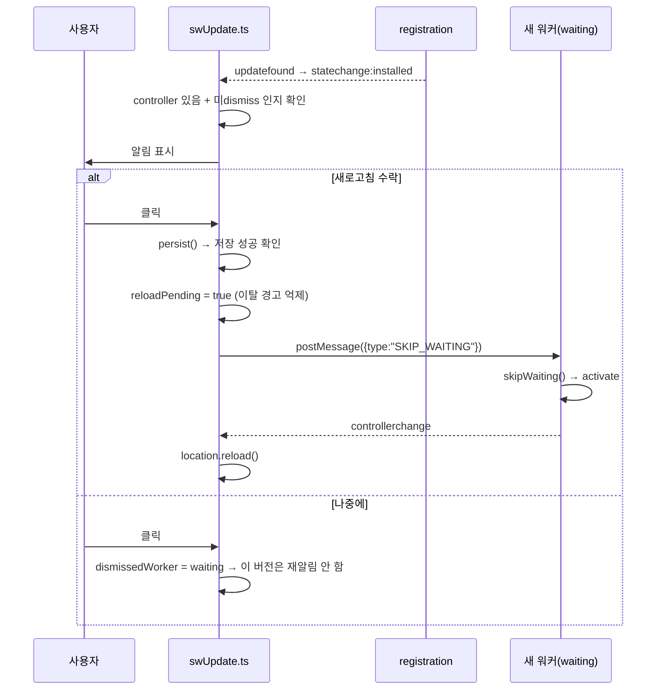
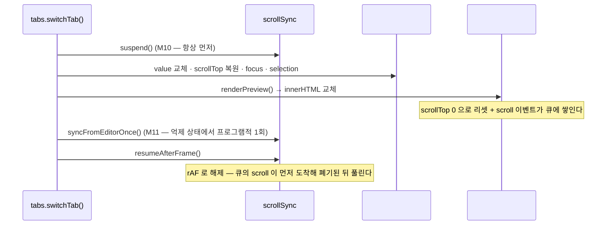

# 서비스 아키텍처

> 최종 갱신: 2026-08-12 · 대상: 웹 전환 (v2.0.0)
> 이전 버전(macOS 네이티브 앱)의 구조는 [웹 전환 히스토리](../history/2026-08-12-web-pivot.md) 참고.

## 1. 한 줄 요약

MarkdownEditor 는 **서버가 없는 100% 클라이언트 웹 애플리케이션**이다. 바닐라 TypeScript 로 작성해 Vite 로 정적 번들링하고, Cloudflare Workers 의 정적 자산 서빙으로 배포한다.

- 백엔드 서버 · 데이터베이스 · 인증 **없음**
- 런타임 네트워크 호출 **없음** (최초 로드 후 완전 오프라인 동작)
- 문서는 **사용자 브라우저와 로컬 디스크에만** 존재한다 — 서버로 전송되지 않는다
- 프로세스 경계는 **브라우저 표준 API**뿐 ([브라우저 API 명세](../api/browser-apis.md))

## 2. 시스템 구성도



## 3. 레이어 정의

| 레이어 | 파일 | 책임 | 의존 |
|--------|------|------|------|
| 부트스트랩 | `src/main.ts` | DOM 조회, 초기화 순서 결정, `beforeunload`/`visibilitychange` 가드 | 전 모듈 |
| 상태 | `src/tabs.ts` | 탭 목록 · 활성 탭 · dirty · 커서/스크롤 · 세션 영속화 | preview, storage |
| 영속 | `src/storage.ts` | localStorage 세션 저장/복원, 스키마 검증 | — |
| 입력 | `src/editor.ts` | textarea `input` 디바운스(150ms) → 프리뷰 갱신 | preview |
| 렌더 | `src/preview.ts` → `src/parser.ts` | 마크다운 → HTML 변환 + **DOMPurify 정화** 후 주입 | marked, dompurify |
| UI 액션 | `src/toolbar.ts` | 파일 4 + 서식 12 = 16개 버튼. `execCommand("insertText")` 로 undo 보존 | — (콜백 주입) |
| 단축키 | `src/shortcuts.ts` | Cmd/Ctrl+O·S, Shift+S, Alt+N·W | fileOps, tabs |
| I/O | `src/fileOps.ts` | File System Access API ↔ 업로드/다운로드 폴백 분기 | tabs, notice |
| 알림 | `src/notice.ts` | 저장 성공·실패·용량 초과를 화면에 표시 | — |
| 오프라인 | `public/sw.js` | 서비스 워커. 앱 셸 캐시 + 자산별 캐시 전략 | — (별도 실행 컨텍스트) |
| 갱신 알림 | `src/swUpdate.ts` | 새 버전 감지 · 알림 표시 · 갱신 결정 (F-69) | — (**리프**, host 주입) |
| 오프라인 표시 | `src/offline.ts` | 연결 상태 배지 (F-70) | — (**리프**, host 주입) |
| 한계 안내 | `src/fsLimitNotice.ts` | 폴백 브라우저의 저장 동작 차이 안내 (F-58) | — (**리프**, host 주입) |
| 스크롤 동기화 | `src/scrollSync.ts` | 에디터 ↔ 프리뷰 양방향 스크롤 연동 (F-25) | — (**리프**, host 주입) |
| 단축키 정의 | `src/shortcutDefs.ts` | 조합 판별 + 표시용 키 캡의 **단일 출처** (F-58) | — (**순수**) |
| 단축키 안내 | `src/shortcutHelp.ts` | `<dialog>` 목록 렌더 (F-58) | `shortcutDefs` (**리프**, host 주입) |
| 검색 계산 | `src/searchEngine.ts` | 일치 탐색·순환·서수 보존 (F-22) | — (**순수**) |
| 검색 UI | `src/search.ts` | 검색 바 배선 (F-22) | `searchEngine` (**리프**, host 주입) |
| 분할 계산 | `src/splitLayout.ts` | 비율 자르기·단계 이동 (F-32) | — (**순수**) |
| 분할 리사이저 | `src/splitter.ts` | 드래그·키보드 배선 (F-32) | `splitLayout` (**리프**, host 주입) |
| 보기 모드 | `src/viewMode.ts` | 분할/편집 전용/미리보기 전용 (F-33) | — (**리프**, host 주입) |
| HTML 내보내기 | `src/htmlExport.ts` | 독립 실행 HTML 문서 조립 (F-38) | — (**순수**) |
| 텍스트 계산 | `src/textEdit.ts` | 감싸기·줄머리·블록 삽입 문자열 계산 | — (**리프**, DOM 없음) |

## 4. 초기화 순서 (`main.ts`)



**순서 의존성**
- `initFileOps()` 는 `initTabs()` **이전**에 호출해야 한다. 세션 복원이 탭 상태를 만들기 전에 input 리스너가 준비돼야 하기 때문이다.
- `setCloseConfirm()` 은 `initTabs()` 이전이어야 복원 직후의 닫기도 보호된다.
- `setFileActions()` 는 `initToolbar()` 이전이어야 파일 버튼이 동작한다.

## 5. 핵심 데이터 흐름

### 5.1 타이핑 → 프리뷰 → 자동 저장



프리뷰(150ms)와 세션 저장(500ms)은 **서로 다른 디바운스**를 쓴다. dirty 표시만 즉시 반영된다.

### 5.2 탭 전환과 커서 복원

`switchTab(id)` 순서:

1. `syncActiveTab()` — 현재 탭에 `value`/`scrollTop`/`selection` 스냅샷
2. `activeTabId` 갱신
3. `editorEl.value` / `scrollTop` 복원
4. **`editorEl.focus()`** — 포커스를 되돌린 뒤
5. `setSelectionRange()` 로 커서 복원
6. 프리뷰 재렌더 → 탭 바 재렌더 → 타이틀 갱신 → 세션 저장 예약

> 4번이 없으면 커서가 복원되지 않는다. 포커스 없는 textarea 의 선택 영역은 클릭 이벤트가 끝나면서 브라우저가 0,0 으로 되돌리기 때문이다. (웹 전환 중 발견해 수정)

### 5.3 저장 경로 분기



## 6. 브라우저 지원 매트릭스

| 기능 | Chrome·Edge | Safari·Firefox |
|------|-------------|----------------|
| 편집 · 프리뷰 · 탭 · 툴바 | ✅ | ✅ |
| 세션 자동 저장/복원 | ✅ | ✅ |
| 파일 열기 | ✅ 파일 선택기 | ✅ 업로드 |
| 저장(덮어쓰기) | ✅ | ❌ — 매번 새 파일 다운로드 |
| 중복 파일 열기 방지 | ✅ `isSameEntry()` | ❌ — 핸들이 없어 판별 불가 |

지원 여부는 `document.body.dataset.fsAccess` 로도 노출되어 E2E 와 디버깅에 쓰인다.

**사용자에게 알린다 (F-58)**: 폴백 브라우저에서 **첫 저장을 시도하는 순간** 세션당 1회 안내를 띄운다. Safari 사용자가 `note.md` 를 저장했는데 `note (1).md` 가 다운로드되고 원본은 그대로인 상황은, 설명이 없으면 앱 결함으로 오해된다. 진입 시가 아니라 실제로 그 동작을 마주친 시점에 설명하는 것이 맥락상 가장 잘 읽힌다. Chrome·Edge 에서는 표시되지 않으며 E2E 가 이를 단언한다.

## 7. 설계상의 트레이드오프 / 알려진 제약

| 항목 | 현재 구현 | 비고 |
|------|-----------|------|
| XSS | `parser.ts` 가 **DOMPurify 로 정화** + `_headers` 의 **CSP** 2중 방어 | `parseMarkdown()` 을 우회해 `innerHTML` 을 쓰면 안 된다 |
| 저장 확인 | dirty 탭 닫기 시 `confirm()`, 페이지 이탈 시 `beforeunload` | 갱신 리로드 시에는 **세션 저장 성공을 확인한 뒤에만** 억제 (§7.2) |
| 세션 지속성 | localStorage 자동 저장 + 복원 | 파일 핸들은 직렬화 불가 — 복원 탭은 저장 시 위치를 다시 묻는다 |
| 저장소 용량 | localStorage 5MB 내외 공용 | 초과 시 **사용자에게 알린다**(F-54). 다만 오래된 탭을 자동 회수하지는 않아 이후 자동 저장은 멈춘 상태로 유지된다 |
| 탭 순서 | `Map` 삽입 순서 고정, 드래그 재정렬 불가 | 기능 부재 |
| 모듈 결합 | `tabs.ts`/`fileOps.ts` 가 모듈 레벨 가변 싱글턴 사용 | 단위 테스트가 어려움 |
| 협업 | 단일 사용자 전용 | 실시간 공동 편집 없음 |

상세 미구현 목록은 [기능 개발 현황](../features/feature-status.md) 참고.

## 7.1 오프라인 (서비스 워커)

`public/sw.js` 가 자산 성격에 따라 캐시 전략을 나눈다.

| 대상 | 전략 | 사유 |
|------|------|------|
| 내비게이션(HTML) | network-first → 캐시 폴백 | 새 배포를 즉시 반영해야 한다. cache-first 면 업데이트가 영원히 안 보인다 |
| `/assets/*` | cache-first | 콘텐츠 해시가 붙어 내용이 절대 안 바뀐다 |
| 그 외 동일 출처 | network-first → 캐시 폴백 | 안전한 기본값 |

`install` 에서 앱 셸(`/`, `/index.html`, `/manifest.webmanifest`, `/icon.svg`)을 캐시하고, `activate` 에서 구버전 캐시를 지우고 `clients.claim()` 한다. 빌드 타임 프리캐시 목록 주입(workbox 등)을 쓰지 않으므로 나머지 자산은 첫 요청 때 채워진다.

**등록 조건**: `import.meta.env.PROD` 일 때만 등록한다. 개발 서버에서 등록하면 HMR 결과가 캐시에 가려 "고쳤는데 안 바뀌는" 상황이 생긴다. 등록 자체는 `swUpdate.ts` 가 수행한다(§7.2).

**알려진 공백**: 오프라인 상태 표시가 없다([F-70](../features/feature-status.md)).

## 7.2 갱신 알림 (F-69)

PWA 도입이 만든 부작용 — 캐시 때문에 **이미 열려 있는 탭의 사용자가 옛 버전을 계속 보는 구간** — 을 해소한다.

### 생명주기 변경

`install` 에서 `skipWaiting()` 을 호출하지 **않는다.** 이 호출이 있으면 새 워커가 대기 상태에 머무르지 않고 즉시 활성화되어 **"감지할 시점" 자체가 사라진다.** 대신 사용자가 갱신을 수락하면 페이지가 메시지를 보내고, 그때 워커가 스스로 활성화한다.

| 방향 | 메시지 | 트리거 |
|------|--------|--------|
| 페이지 → 워커 | `{ type: "SKIP_WAITING" }` | 사용자가 "새로고침" 클릭 |
| 워커 → 페이지 | (없음 — `controllerchange` 로 대체) | 새 워커 활성화 완료 |



### 설계 결정과 그 이유

| 결정 | 이유 |
|------|------|
| `postMessage` 대상은 `registration.waiting` | `navigator.serviceWorker.controller` 로 보내면 **구 워커**에게 가서 아무 일도 일어나지 않는다 |
| `controllerchange` 는 갱신 수락 시점에만 구독 | 상시 구독하면 최초 설치의 `clients.claim()` 으로도 발화해 오작동한다 |
| 최초 설치(제어 워커 없음)에는 알림 없음 | 첫 방문자에게 "새 버전"은 오정보다 |
| 3초 타임아웃 후 강제 리로드 | 활성화 신호가 오지 않아도 사용자가 멈춰 있지 않게 |
| `swUpdate.ts` 는 앱 모듈을 import 하지 않는다 | `notice.ts` 를 확장하면 `tabs → notice → tabs` 순환이 생긴다. 필요한 능력은 `main.ts` 가 `SwUpdateHost` 로 주입 |
| Esc 리스너는 `#sw-update` 요소에 부착 | `document` 전역은 `shortcuts.ts` 와 충돌한다 |
| "나중에" 시 **포커스 복원 → 숨김** 순서 | 반대로 하면 포커스를 가진 버튼이 먼저 사라져 `<body>` 로 떨어진다 |

### 데이터 안전

갱신은 페이지 리로드를 수반한다. `persistNow()` 로 세션을 확정 저장하고 **성공한 경우에만** `beforeunload` 경고를 억제한다.

- 무조건 억제하면 저장소 용량 초과 시 진짜 유실이 발생한다.
- 무조건 경고하면 실제로는 안전한 상황을 위험하다고 잘못 알려, 사용자가 갱신을 취소하고 기능이 무력화된다.
- 저장 실패 + 미저장 탭이 있으면 앱이 직접 확인을 받는다.
- 억제는 **이 리로드 1회 한정**이라 일반 탭 닫기 경고는 그대로 살아 있다.

### 빌드 ID 주입 — 기능의 전제

`sw.js` 는 `src/` 를 참조하지 않으므로, 앱 코드만 고쳐 배포하면 `/sw.js` 응답 바이트가 **동일**하다. 그러면 브라우저가 `updatefound` 를 발화하지 않아 **알림이 한 번도 뜨지 않는다.** 실패 모드가 조용한 무동작이라 알아채기도 어렵다.

vite 는 `public/` 을 변환 없이 복사만 하므로 `transform` 훅이 닿지 않는다. `writeBundle` 훅(복사 이후)에서 `dist/sw.js` 의 `__BUILD_ID__` 를 치환하고, **플레이스홀더를 못 찾으면 빌드를 실패시킨다.**

### 과도기 1회

`skipWaiting()` 제거는 한 번의 과도기를 만든다. 현재 배포된 워커에는 아직 그 호출이 남아 있어 **다음 배포는 자동 활성화**되고, 그 **다음** 배포부터 알림이 동작한다. 정상 동작이며 버그가 아니다.

## 7.3 오프라인 상태 표시 (F-70)

오프라인에서도 앱은 **완전히 동작**하지만(편집·프리뷰·탭·자동 저장·파일 저장 전부 로컬), 화면이 평소와 같아 사용자가 자신의 연결 상태를 알 수 없었다.

| 결정 | 이유 |
|------|------|
| `online`/`offline` 이벤트 + `navigator.onLine` 만 사용 | 이 앱은 최초 로드 후 네트워크를 거의 쓰지 않아 "실제 도달 여부"를 알아낼 자연스러운 요청이 없다. 감지를 위해 일부러 요청을 만드는 것은 과잉 설계이고, 오탐은 정보 전달이라는 목적을 해친다 |
| 지속형 배지 (토스트 아님) | 오프라인은 지속 상태다. 4초 자동 숨김 토스트는 자리를 비운 사이 사라져 무의미해진다 |
| `#sw-update` 뒤(스택 맨 아래) | "지속형 아래, 일시 토스트 위" 원칙 유지 + 액션이 필요한 알림(갱신)을 정보성 알림보다 위에 |
| 경고색 미사용, "편집·저장은 이 기기에서 계속 동작합니다" 명시 | 표시가 "저장이 안 된다"는 오해를 주면 안 된다. 경고가 아니라 정보 전달이다 |

`swUpdate.ts` 와 같은 **주입형 리프**다. 전역 `navigator.onLine` 과 `window` 이벤트를 직접 읽지 않고 `OfflineHost` 로 주입받아 가짜 host 로 전량 단위 검증된다.

## 7.4 스크롤 동기화 (F-25) · 영역 시각 구분 (F-72)

이 에디터의 핵심 가치는 실시간 프리뷰인데, 문서가 화면을 넘어가는 순간 **양쪽을 비교할 수 없어** 그 가치가 사라진다. 시각 구분이 약한 것도 같은 문제의 다른 면이다.

### 매핑 — 비율 기반을 택한 이유

`scrollTop / (scrollHeight - clientHeight)` 로 정규화한다. 단순 백분율이 아니라 **스크롤 가능 거리 기준**이라 양 끝이 정확히 일치한다 — 사용자가 가장 확실히 알아채는 어긋남이 "끝까지 내렸는데 반대쪽은 안 끝났다" 이기 때문이다.

**소스 라인 ↔ 렌더 요소 매핑은 기각했다.** 더 정확하지만 `marked` renderer 확장 → 라인 속성 주입 → **DOMPurify 허용 목록 개방**이 필요하다. 스크롤 편의 기능이 F-18 XSS 방어를 여는 것은 교환 비율이 맞지 않는다.

**수용된 한계**: 긴 코드블록·이미지 구간에서는 중간부가 어긋난다. 이 앱 문서는 대개 수백 줄 규모라 어긋남이 한 화면 이내이고, 목표는 줄 정렬이 아니라 **비교할 대목이 화면 안에 있는 것**이다. E2E 판정 기준도 "완전 일치" 가 아니라 "양 끝 ≤2px + 중간부 한 화면 이내" 로 세웠다 — 그러지 않으면 설계된 동작이 버그로 잡힌다.

### 소유권 모델 — 무한 루프 방지

| 규칙 | 내용 |
|------|------|
| R1 | 사용자 스크롤이 발생한 패널이 소스, 반대편이 종속 |
| R2 | 프로그램적으로 대입한 값을 `expectedTop` 에 기록하고, 그 패널의 다음 scroll 이 1px 이내로 같으면 **메아리**로 판별해 폐기 |
| R3 | 소유권은 **시간 만료로 해제되지 않는다.** `setTimeout`/`setInterval` 이 이 파일에 한 번도 등장하지 않는 것이 리뷰 가능한 불변식이다 |

**R2 에서 불리언 플래그를 쓰지 않는 이유**: 프로그램적 `scrollTop` 대입은 scroll 이벤트를 **동기적으로 발화하지 않는다**(다음 렌더링 기회 직전 큐에서 전달). 대입 직후 내리는 플래그는 이벤트 도착 시점에 이미 `false` 라서 그 이벤트가 사용자 스크롤로 오분류되고 루프가 그대로 돈다. 값 비교는 이 문제를 근본적으로 피한다.

**R3 이 필요한 이유**: 타이머 만료형 소유권 해제는 관성 스크롤(터치·트랙패드)의 잔여 이벤트를 새 입력으로 오인해 두 패널이 서로 밀어내는 진동을 만든다.

### `switchTab()` 연동 — 억제 → 복원 → 해제 순서



**억제 해제를 동기적으로 하면 F-06/F-51 이 회귀한다.** `innerHTML` 교체가 큐에 넣은 scroll 이벤트는 `switchTab()` 이 끝난 뒤 도착한다. 즉시 해제하면 이것이 사용자 스크롤로 분류돼 `ratio=0` → **`editorEl.scrollTop = 0`** 으로 복원값이 날아간다. `setTimeout(…, 0)` 은 이 순서를 보장하지 않으므로 쓰지 않는다.

`tabs.ts` 는 `scrollSync.ts` 를 **import 하지 않는다.** `setScrollSyncHooks()` 로 주입받으며(기본값 `null` = 무동작), 이 덕에 기존 단위 테스트 34건이 영향을 받지 않는다.

### 초기화 실패와 리스너 롤백 (#33)

리스너 부착은 이 초기화에서 **유일하게 되돌릴 수 없는 부작용**이다. 한쪽 패널만 붙은 채 실패하면, 재시도가 두 번째 엔진을 만들어 **서로 다른 상태를 가진 두 클로저가 같은 `scrollTop` 을 다툰다.**

| 상황 | 동작 |
|------|------|
| 부착 전 실패 | 잠금 없음 → 재시도 가능 |
| 부분 부착 후 실패, `removeEventListener` 있음 | 붙은 것을 떼고 잠금 없음 → 재시도 가능 |
| 부분 부착 후 실패, `removeEventListener` 없음 | **잠근 채 실패** — 엔진 중복보다 무동작이 낫다 |

`initialized = true` 는 성공 경로 끝에서만 설정한다. 이 순서를 되돌리면 한 번도 성공한 적 없는데 "이미 초기화되어 재호출을 무시합니다" 라는 **사실과 다른 경고**가 뜬다.

### 렌더가 진행 중이던 동기화를 삼키지 않는다 (#34)

`reapplyAfterRender()` 는 내부적으로 `suspend()` 를 부르고, `suspend()` 는 대기 중인 `applyFrame` 을 취소한다. 사용자가 **스크롤과 타이핑을 동시에** 하면 방금 만든 스크롤 한 프레임이 사라지고, 낡은 `lastRatio` 가 덮어써져 **다음 스크롤까지 어긋난 채 남는다.**

그래서 취소 **전에** 최신 비율을 확정한다:

```ts
const pendingRatio =
  frameId !== null && source === "editor" ? computeRatio(panels.editor) : null;
const ratio = pendingRatio ?? lastRatio;
```

**소스가 에디터일 때만 되살릴 수 있다.** 소스가 프리뷰였다면 그 비율의 근거인 `preview.scrollTop` 을 이미 `innerHTML` 교체가 0 으로 지운 뒤라, 이 시점에 복원할 정보가 남아 있지 않다. 에디터에 타이핑하면서 동시에 프리뷰를 스크롤해야 닿는 경로다.

### 인쇄 / PDF (F-39)

**`Cmd/Ctrl+P` 를 가로채지 않는다.** F-22 검색은 브라우저 기본 찾기가 textarea 안을 못 봐서 가로챌 이유가 있었지만, 인쇄는 **브라우저 기능이 곧 우리가 원하는 동작**이다. 가로채면 같은 일을 한 겹 더 감싸면서 대화상자 취소·미리보기 동작만 잃는다. 필요한 것은 스타일뿐이다.

PDF 라이브러리도 넣지 않는다 — "PDF 로 저장" 은 브라우저 인쇄 대화상자 안에 이미 있다.

| 인쇄에서 하는 일 | 이유 |
|------------------|------|
| 툴바·탭바·검색 바·리사이저·알림·에디터 숨김 | 앱 껍데기는 종이에 없다 |
| `#preview` 를 `!important` 로 되살림 | **편집 전용 모드(F-33)에서 인쇄하면 빈 종이가 나온다** — `[data-mode="editor"] #preview { display: none }` 이 걸려 있다 |
| 흰 배경·검은 글씨 강제 | 다크 모드로 보고 있어도 종이에 잉크를 쏟지 않는다 |
| `break-inside: avoid` (코드·표·인용·이미지) | 덩어리가 페이지 경계에서 잘리면 읽을 수 없다 |
| `break-after: avoid` (제목) | 제목만 남고 본문이 다음 장으로 넘어가는 것을 막는다 |
| 외부 링크 뒤에 주소 표시 | 종이에서는 링크를 누를 수 없다. **내부 앵커는 제외** — 주소를 적어도 의미가 없고 소음만 된다 |

전부 `@media print` 안에 있어 화면 표시에는 영향이 없다.

> `!important` 하나면 `data-mode` 규칙을 이긴다 — 선택자 특이도와 무관하다. 처음에는 `.editor-container[data-mode] #preview` 를 함께 적었는데, **지워도 아무 테스트가 실패하지 않아(= 하는 일이 없어) 지웠다.**

### HTML 내보내기 (F-38)

렌더 결과를 **독립 실행 가능한** HTML 파일로 내보낸다. 스타일이 파일 안에 들어 있어 인터넷 없이도 같은 모양으로 열린다.

#### 정화 경로는 하나뿐이다 (F-18)

`htmlExport.ts` 는 **마크다운을 파싱하지 않는다.** 이미 프리뷰에 들어가 있는(= `parseMarkdown()` → DOMPurify 를 거친) HTML 을 그대로 받아 감싸기만 한다.

원문을 다시 파싱하는 두 번째 경로를 만들면 정화 정책이 두 곳으로 갈라지고, **한쪽만 갱신되는 순간 F-18 이 뚫린다.** 내보낸 파일은 다른 사람이 열기 때문에 앱 안보다 위험도가 높다.

다만 **제목은 예외다.** 사용자가 지은 파일명에서 오고 DOMPurify 를 거치지 않으므로 `escapeHtmlText()` 로 직접 막는다 — `</title>` 이 든 이름이 문서 구조를 깨뜨릴 수 있다.

#### 내보내기는 저장이 아니다

`exportFile()` 은 `saveFile()`/`saveFileAs()` 와 달리 **탭의 핸들·파일명·dirty 를 건드리지 않는다.** 탭이 `note.html` 을 가리키게 되면 다음 `Cmd+S` 가 **마크다운 원문을 `.html` 파일에 덮어쓴다.**

#### 라이트 한 가지로 고정

내보낸 파일이 열리는 환경은 알 수 없고 대개 인쇄·첨부·전달 용도다. `prefers-color-scheme` 을 따르게 하면 받는 쪽 설정에 따라 첨부 문서의 모양이 달라진다.

### 보기 모드 (F-33)

F-32 가 **양쪽을 보되 크기를 조절**하는 것이라면, 이쪽은 **한쪽만 본다.** 그래서 F-32 의 하한/상한이 0 을 허용하지 않아도 된다.

| 판단 | 근거 |
|------|------|
| `data-mode` 속성 하나로 전환 | 요소를 지우거나 다시 만들면 에디터의 스크롤 위치·선택·포커스가 날아가고 탭 상태와 어긋난다 |
| **`display: none`** 으로 숨김 | 숨은 패널의 `clientHeight` 가 0 이 되어 F-25 의 `> 0` 가드에 걸린다 → 동기화가 조용히 무동작. `visibility`/`opacity` 로 숨기면 **크기가 남아 동기화가 계속 돌면서 보이지 않는 패널을 따라 움직인다** |
| 분할 비율은 건드리지 않음 | 모드를 되돌리면 사용자가 맞춰 둔 비율이 그대로 돌아와야 한다. 두 설정은 독립이다 |
| 버튼 하나로 순환 | 버튼 3개는 툴바를 붐비게 하고, 대부분 "지금 말고 다른 것" 을 원한다 |
| `aria-pressed` 는 분할이 아닐 때만 `true` | 기본 상태를 눌린 것으로 표시하면 늘 뭔가 켜져 있다고 오해된다 |

#### 클릭 소스는 툴바 하나뿐이다

`viewMode.ts` 는 버튼의 `aria-*` 만 갱신하고 **클릭은 듣지 않는다.** 툴바가 이미 모든 버튼의 클릭을 다루므로 여기서도 들으면 **한 번 눌러 두 단계** 넘어간다(실제로 그렇게 동작했다).

#### 초기화 순서

`initToolbar()` 가 버튼을 만든 **뒤에** `initViewMode()` 를 호출해야 `#view-mode` 를 찾는다. 순서가 뒤집히면 클릭은 동작하지만 `aria-pressed`/`aria-label` 이 비어 **스크린리더에게는 상태 없는 버튼**이 된다 — 눈으로는 드러나지 않는다.

### 분할 비율 조절 (F-32)

좌우(720px 초과) 또는 상하(720px 이하) 경계를 드래그·키보드로 옮긴다. 비율은 세션과 **별도 키**(`markdown-editor:layout:v1`)에 저장된다 — 문서 세션은 손상 시 통째로 버리는 정책인데, 그때 레이아웃 설정까지 날릴 이유가 없다.

| 판단 | 근거 |
|------|------|
| 하한 15% · 상한 85% | 0 을 허용하면 한쪽을 완전히 접은 뒤 **되돌릴 손잡이도 함께 사라진다.** 한쪽만 보고 싶은 요구는 F-33 이 담당한다 |
| `setPointerCapture` | `document` 에 mousemove 를 붙이면 포인터가 창 밖으로 나갈 때 놓쳐 드래그 상태로 굳는다 |
| 드래그 중에는 저장하지 않음 | 매 프레임 localStorage 쓰기는 낭비. `pointerup` 에서 한 번만 |
| 키보드 지원 (`role="separator"`) | 드래그 전용이면 키보드 사용자에게는 **없는 기능**이다 |
| 경계선은 리사이저가 그린다 | `#editor` 에도 테두리를 두면 1px 이 두 줄로 겹쳐 보인다 — 경계는 한 곳에서만 |

#### F-25 억제 훅을 붙이지 않았다 (실측 결과)

`tabs.ts` 처럼 `suspend`/`resumeSync` 훅을 주입하는 방안을 **구현해 두고 실측**했다. 있으나 없으나 드래그 후 두 패널의 비율 차이가 **0 으로 동일**했다 — F-25 의 메아리 판별(`expectedTop`)과 소유권 모델이 리사이즈로 생기는 scroll 이벤트를 이미 올바르게 처리한다.

검증되지 않는 방어 코드는 남기지 않았다. 되살리려면 **먼저 재현되는 실패를 만들 것.**

### 문서 내 검색 (F-22)

브라우저 기본 `Cmd/Ctrl+F` 는 **textarea 안의 텍스트를 찾지 못한다.** 프리뷰만 검색되므로 긴 문서를 편집하다 특정 대목을 찾을 방법이 사실상 없었다.

| 판단 | 근거 |
|------|------|
| `Cmd/Ctrl+F` 를 그대로 뺏는다 | `⌘W`·`⌘N` 과 달리 이 조합은 페이지에 도달하고 `preventDefault()` 가 먹는다(실측). 익숙한 키를 두고 새 조합을 가르치면 발견성만 나빠진다. 브라우저 찾기가 필요하면 검색창을 닫고 한 번 더 누르면 된다 |
| 모달이 아니라 **상단 바** | 찾은 위치를 **보면서** 이동해야 하므로 F-58 의 `<dialog>` 와 달리 본문을 가리면 안 된다 |
| 정규식이 아니라 **리터럴** | 마크다운 문서에서 `*`·`[`·`(` 를 찾는 일이 잦다. 정규식이면 이것들이 메타문자가 되어 아무것도 안 찾아지거나 예외가 난다 |
| 겹치는 일치는 세지 않는다 | `"aaaa"` 에서 `"aa"` 는 2개. 겹침을 세면 "다음" 을 눌렀을 때 커서가 한 글자씩 기어가 사용자가 진행을 인지하지 못한다 |
| 치환은 범위 밖 | 찾기만으로 원래 목적(대목 찾아가기)이 충족된다. 치환은 실행 취소·범위 선택 등 별개의 설계가 필요하다 (F-22 잔여) |

#### 포커스는 검색창에 남는다

`reveal()` 이 에디터로 포커스를 옮기면 **Enter 가 본문에 개행을 넣어 방금 찾은 일치를 지운다.** 처음 구현이 실제로 그랬고, E2E 가 "1/3 → 1/2" 로 잡아냈다.

브라우저 찾기 막대와 같은 방식으로, 선택만 걸어 두고 포커스는 검색창에 남긴다. Esc 로 닫으면 그 선택이 곧바로 활성 선택이 되어 **찾은 자리에서 편집을 이어갈 수 있다.**

#### 스크롤은 미러 요소로 잰다

`setSelectionRange()` 는 선택만 하고 스크롤하지 않는다. 줄 높이 × 줄 번호로 어림하면 **줄바꿈(wrap)된 줄에서 빗나간다.** 같은 폭·글꼴·`white-space` 를 가진 숨은 요소에 일치 지점까지의 텍스트를 넣고 그 높이를 재면 wrap 을 포함해 정확하다. 일치는 화면 위쪽 1/3 지점에 둔다 — 정중앙은 뒤따르는 문맥이 좁고, 맨 위는 앞 문맥이 사라진다.

이 측정은 `measureOffsetTop` 으로 주입 가능하다. jsdom 은 레이아웃이 없어 이 경계가 없으면 배선을 단위 테스트로 검증할 수 없다.

#### 일치는 이동 직전에 항상 다시 계산한다

**탭 전환은 `input` 이벤트 없이 `editorEl.value` 를 바꾼다**(`tabs.ts`). 캐시해 두면 다른 문서의 좌표로 이동하는 사고가 난다.

> 이 불변식은 E2E 로는 검증되지 않는다. `main.ts` 가 `onAfterRender → refresh()` 를 걸어 두어 탭 전환 시 렌더가 대신 갱신해 주기 때문이다 — 실제로 `go()` 의 재계산을 지워도 E2E 는 전부 통과했다. 그래서 렌더 알림 없이 `value` 만 바꾸는 단위 테스트로 못을 박았다.

#### 치환 — 실행 취소를 지키는 것이 전부다

이 앱은 `execCommand("insertText")` 로 undo 스택을 보존한다(`toolbar.ts` 와 같은 이유). **`textarea.value` 를 직접 대입하는 순간 Cmd+Z 로 되돌릴 수 없게 된다** — 문서 전체를 바꾸는 "모두 바꾸기" 에서 이건 데이터 유실에 가깝다.

| 동작 | 구현 | 이유 |
|------|------|------|
| 1건 치환 | 일치 범위를 선택 → `insertText` | undo 1회 |
| 모두 바꾸기 | `replaceAll()` 로 **전체 문자열**을 만들고 문서 전체를 한 번에 `insertText` | undo **1회**. 부분 치환을 N번 반복하면 Cmd+Z 를 N번 눌러야 한다 |

`replaceAll()` 이 부분 치환을 반복하지 않는 두 번째 이유는 **무한 루프 방지**다. `"a"` → `"aa"` 처럼 치환 결과가 질의를 포함하면 바꿀 때마다 새 일치가 생긴다. 일치 좌표를 **먼저 전부** 구해 두고 조립하면 원천적으로 안전하다.

같은 이유로 1건 치환 뒤에는 커서를 **치환된 텍스트 끝**으로 넘긴다. 시작에 두면 방금 넣은 텍스트를 다시 잡아 제자리를 맴돈다.

`execCommand` 는 textarea 가 포커스를 가져야 동작하므로, 치환에서는 잠깐 포커스를 옮겼다가 **되돌린다.** 되돌리지 않으면 다음 Enter 가 본문에 개행을 넣는다 — 찾기에서 이미 겪은 함정이다.

치환 행은 기본으로 접혀 있다. 찾기만 쓰는 경우가 훨씬 잦고, 늘 펼쳐 두면 편집 영역을 두 줄 잡아먹는다.

#### 서수를 보존한다 (`remapIndex`)

문서가 바뀐 뒤 "몇 번째 일치인가" 를 유지한다. **"위치가 가장 가까운 일치" 를 고르는 방식도 시도했으나 흔한 경우에 어긋난다** — 문서 앞에 네 글자를 끼워 넣으면 모든 일치가 4씩 밀리고, 그러면 세 번째보다 두 번째가 예전 좌표에 더 가까워져 하이라이트가 뒤로 튄다.

타이핑은 대개 일치 **개수를 바꾸지 않고 좌표만 민다.** 그 지배적인 경우에 서수 보존은 항상 옳다. 앞쪽 일치를 통째로 지우면 서수가 한 칸 밀리는데, 이건 받아들인 한계다.

### 단축키 안내 (F-58)

웹에는 메뉴바가 없다. 네이티브 앱이라면 메뉴를 열어 단축키를 발견하지만, 이 에디터에서는 `⌥N`·`⌥W` 같은 **비표준 조합**을 알아낼 통로가 아예 없었다. 그 조합이 비표준인 것도 자의가 아니라 브라우저가 `⌘N`/`⌘W` 를 선점해 `preventDefault()` 로도 막을 수 없기 때문이라, 안내의 필요성은 오히려 더 크다.

#### 단일 출처 — 안내가 낡는 것을 구조적으로 막는다

안내 UI 의 가장 흔한 실패는 **목록이 실제 동작과 어긋나는 것**이다. 단축키를 추가하고 안내를 고치지 않으면 안내가 조용히 거짓말을 시작하고, 그건 안내가 아예 없는 것보다 나쁘다. 테스트로 잡기보다 **불가능하게** 만드는 편이 낫다.

```
shortcutDefs.ts  (유일한 정의: 조합 판별 + 표시용 키 캡)
   ├── shortcuts.ts     디스패치
   └── shortcutHelp.ts  안내 목록 렌더
```

`shortcuts.ts` 의 디스패치 테이블이 `Record<ShortcutId, () => void>` 라서, 정의에 단축키를 추가하고 동작을 빠뜨리면 **컴파일 단계에서 막힌다.**

#### 왜 네이티브 `<dialog>` 인가

포커스 트랩·Esc 닫기·백드롭·바깥 요소 `inert` 처리를 브라우저가 이미 정확히 해 준다. 직접 구현하면 그 전부를 다시 만들어야 하고, 이 저장소에서 포커스 관련 버그가 이미 두 번 났다(탭 전환 커서 리셋, F-69 알림 포커스 순서). 접근성은 손으로 만들 때 가장 조용히 틀리는 영역이다.

#### `<dialog>` 를 쓰며 밟은 두 함정

| 함정 | 증상 | 대응 |
|------|------|------|
| 전역 리셋 `* { margin: 0 }` 이 UA 의 `dialog:modal { margin: auto }` 를 덮어쓴다 | 다이얼로그가 화면 **좌상단에 붙는다.** 기능은 멀쩡해서 테스트 없이는 그대로 배포된다 | `.shortcut-help { margin: auto }` |
| 백드롭 클릭의 히트 타깃이 `dialog` 가 **아니다** | "백드롭 클릭은 dialog 자신을 타깃으로 준다" 는 통설과 달리 Chromium 은 아래 깔린 요소를 준다(실측 `DIV`) | 좌표가 다이얼로그 사각형 밖인지로 판단 |

바깥 클릭은 `click` 이 아니라 **`pointerdown`** 으로 듣는다. 여는 클릭이 계속 버블링해 방금 연 다이얼로그를 즉시 닫는 경합이 생기는데, `pointerdown` 은 다이얼로그가 열리기 **전에** 이미 지나갔으므로 이 경합이 구조적으로 생기지 않는다 — 타이머로 무시 구간을 두는 방식과 달리 순서 가정에 기대지 않는다.

#### 여는 경로가 둘인 이유

툴바 버튼과 `⌥/`. 단축키만 두면 **"단축키를 알려주는 기능을 단축키로만 열 수 있는"** 순환이 된다. `?` 단독은 본문에 물음표를 입력해야 하므로 쓸 수 없다.

### 다크 모드 (F-57)

`prefers-color-scheme: dark` 에서 **토큰 값만** 바꾼다. 선택자·레이아웃·경계선 두께 등 규칙은 라이트 정의를 그대로 쓴다 — **다크 전용 레이아웃 분기가 하나도 없다는 것**이 이 구현의 핵심이고, 그래서 F-72 의 시각 구분과 720px 이하의 2px 가로 경계가 자동으로 따라온다.

| 토큰 | 라이트 | 다크 |
|------|--------|------|
| `--surface-editor` | `#f2f2f0` | `#2a2a2c` |
| `--surface-preview` | `#ffffff` | `#313134` |
| `--border-split` | `#c8c8c8` | `#4a4a4e` |
| `--text` | `#1a1a1a` | `#e4e4e6` |
| `--text-muted` | `#666666` | `#a8a8ad` |
| `--code-bg` | `#f4f4f4` | `#232326` |
| `--rule-subtle` | `#dddddd` | `#4a4a4e` |

**툴바(`#1e1e1e`)·탭바(`#252526`)는 바꾸지 않는다.** 라이트에서도 이미 어둡기 때문에, 그대로 두면 툴바 → 탭바 → 에디터 → 프리뷰의 명도 계단이 다크에서도 **같은 방향**으로 유지된다. 다크에서 손댈 표면은 아래 두 면뿐이다.

**코드 배경은 다크에서 방향이 뒤집힌다.** 라이트에서는 표면보다 밝은 회색으로 눌러 넣지만(`#f4f4f4` < `#ffffff` 는 아니므로 실은 어둡게), 다크에서는 표면보다 **더 어둡게**(`#232326` < `#313134`) 간다. 밝은 쪽으로 올리면 코드블록이 페이지에서 튀어나와 읽는 흐름을 끊는다.

#### 모든 색은 bare `:root` 에 정의가 있어야 한다

미디어 쿼리 안에서만 정의된 색은 라이트 모드에서 값이 없어 UA 기본값으로 떨어진다. 그래서 라이트를 기준값으로 두고 다크는 **덮어쓰기만** 한다.

#### 폼 컨트롤은 `color` 를 상속하지 않는다

`body` 에만 `color` 를 주면 `textarea#editor` 는 UA 의 `fieldtext` 로 초기화되어 **다크 모드에서 검은 글씨가 어두운 표면 위에 남는다.** 개발 중에는 라이트로 보고 있어 눈에 띄지 않는다. `#editor` 에 `color`·`caret-color` 를 명시한다 — E2E `D4` 가 이 상태를 대비 **1.47:1** 로 잡아냈다.

### 시각 구분 (F-72)

| 토큰 | 값 | 의미 |
|------|-----|------|
| `--surface-editor` | `#f2f2f0` | 작업대 |
| `--surface-preview` | `#ffffff` | 결과물(종이) |
| `--border-split` | `#c8c8c8` | 접합부 |

툴바 `#1e1e1e` → 탭바 `#252526` → 에디터 회색 → 프리뷰 흰색의 **명도 계단**이 "원재료 → 완성물" 방향으로 읽힌다. 두 배경 대비는 **1.12:1** — 경계에서만 인지되고 영역 안에서는 의식되지 않는 수준이다(사용자가 시간 대부분을 보내는 에디터가 "비활성" 으로 오독되면 안 된다). 본문 텍스트 대비는 18.7:1 / 21:1 로 WCAG AA 를 넘는다.

**종이 카드 표현(그림자·여백)은 기각했다** — 이 앱은 툴바 외 전 영역이 꽉 찬 편집 화면이고 그게 성격이다. 명도 차만으로 "종이" 의미는 전달된다.

720px 이하 상하 분할에서는 **시각 구분이 더 중요하다.** 좌우에는 "왼쪽=입력" 관습이 있지만 상하에는 없어, 배경 구분이 없으면 두 영역이 이어진 하나의 문서로 보인다. 경계선도 2px 로 강화한다.

## 8. 관련 문서

- [인프라 아키텍처](./infrastructure.md)
- [데이터 모델](./data-model.md)
- [브라우저 API 명세](../api/browser-apis.md)
- [기능 ↔ 모듈 ↔ 상태 ↔ API 상호 관계](./traceability.md)
