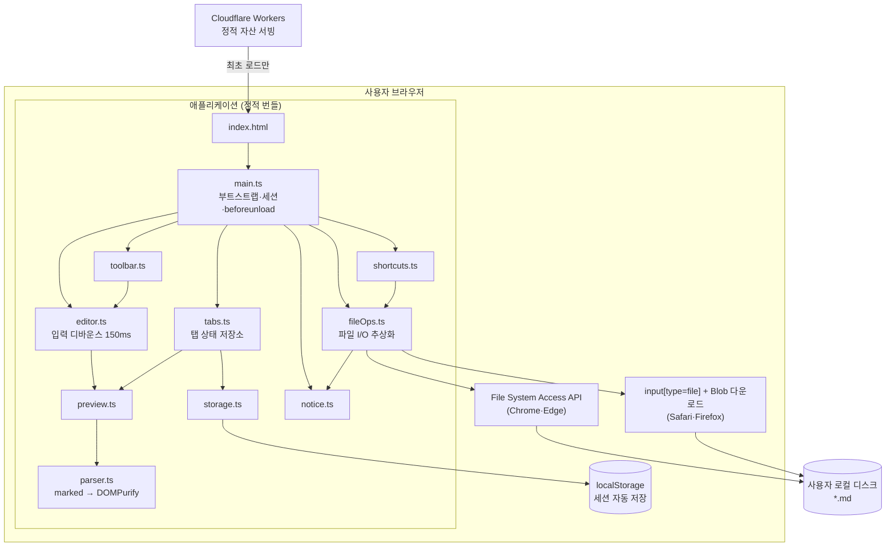
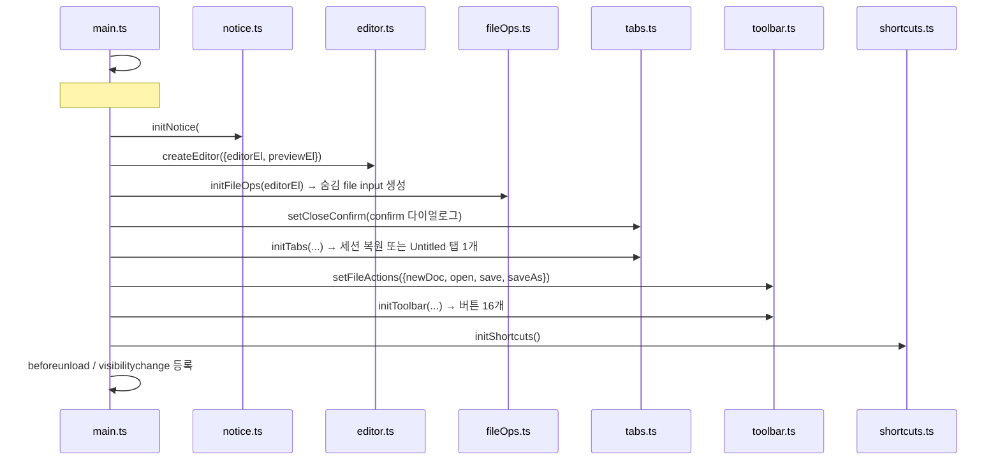
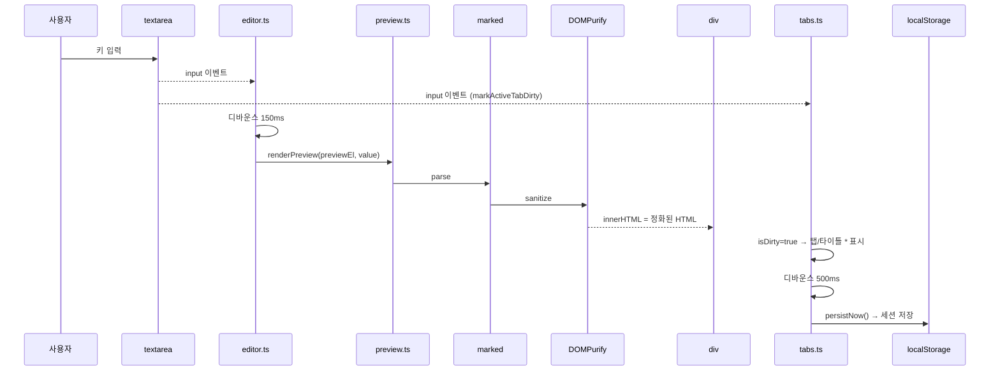
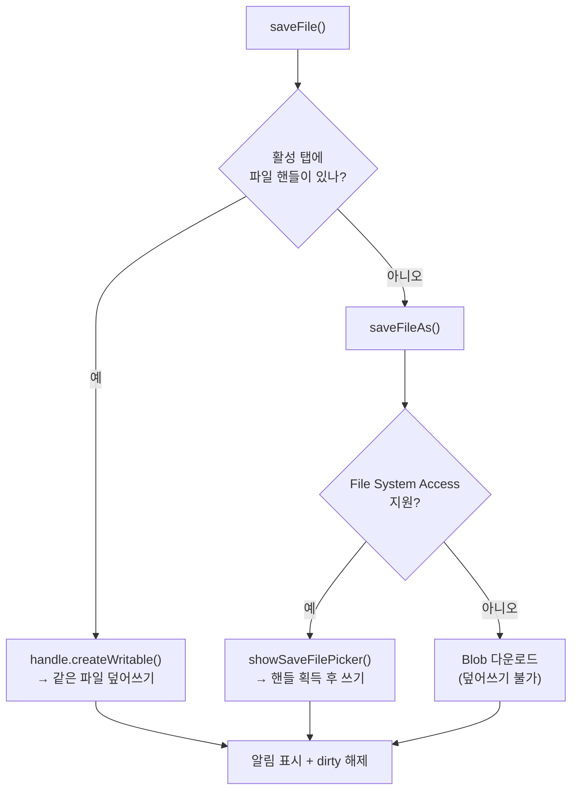
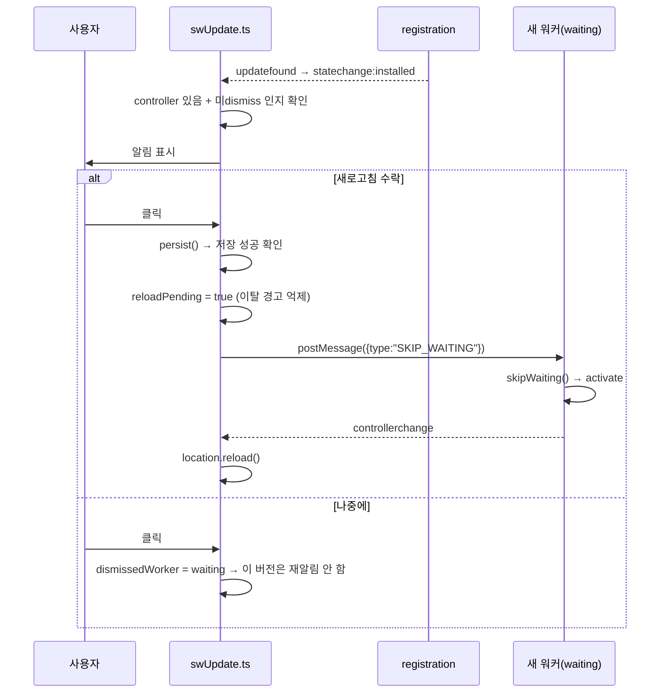

# 서비스 아키텍처

> 최종 갱신: 2026-08-12 · 대상: 웹 전환 (v2.0.0)
> 이전 버전(macOS 네이티브 앱)의 구조는 [웹 전환 히스토리](../history/2026-08-12-web-pivot.md) 참고.

## 1. 한 줄 요약

MarkdownEditor 는 **서버가 없는 100% 클라이언트 웹 애플리케이션**이다. 바닐라 TypeScript 로 작성해 Vite 로 정적 번들링하고, Cloudflare Workers 의 정적 자산 서빙으로 배포한다.

- 백엔드 서버 · 데이터베이스 · 인증 **없음**
- 런타임 네트워크 호출 **없음** (최초 로드 후 완전 오프라인 동작)
- 문서는 **사용자 브라우저와 로컬 디스크에만** 존재한다 — 서버로 전송되지 않는다
- 프로세스 경계는 **브라우저 표준 API**뿐 ([브라우저 API 명세](../api/browser-apis.md))

## 2. 시스템 구성도

## 3. 레이어 정의

| 레이어 | 파일 | 책임 | 의존 |
|--------|------|------|------|
| 부트스트랩 | `src/main.ts` | DOM 조회, 초기화 순서 결정, `beforeunload`/`visibilitychange` 가드 | 전 모듈 |
| 상태 | `src/tabs.ts` | 탭 목록 · 활성 탭 · dirty · 커서/스크롤 · 세션 영속화 | preview, storage |
| 영속 | `src/storage.ts` | localStorage 세션 저장/복원, 스키마 검증 | — |
| 입력 | `src/editor.ts` | textarea `input` 디바운스(150ms) → 프리뷰 갱신 | preview |
| 렌더 | `src/preview.ts` → `src/parser.ts` | 마크다운 → HTML 변환 + **DOMPurify 정화** 후 주입 | marked, dompurify |
| UI 액션 | `src/toolbar.ts` | 파일 4 + 서식 12 = 16개 버튼. `execCommand("insertText")` 로 undo 보존 | — (콜백 주입) |
| 단축키 | `src/shortcuts.ts` | Cmd/Ctrl+O·S, Shift+S, Alt+N·W | fileOps, tabs |
| I/O | `src/fileOps.ts` | File System Access API ↔ 업로드/다운로드 폴백 분기 | tabs, notice |
| 알림 | `src/notice.ts` | 저장 성공·실패·용량 초과를 화면에 표시 | — |
| 오프라인 | `public/sw.js` | 서비스 워커. 앱 셸 캐시 + 자산별 캐시 전략 | — (별도 실행 컨텍스트) |
| 갱신 알림 | `src/swUpdate.ts` | 새 버전 감지 · 알림 표시 · 갱신 결정 (F-69) | — (**리프**, host 주입) |

## 4. 초기화 순서 (`main.ts`)

**순서 의존성**
- `initFileOps()` 는 `initTabs()` **이전**에 호출해야 한다. 세션 복원이 탭 상태를 만들기 전에 input 리스너가 준비돼야 하기 때문이다.
- `setCloseConfirm()` 은 `initTabs()` 이전이어야 복원 직후의 닫기도 보호된다.
- `setFileActions()` 는 `initToolbar()` 이전이어야 파일 버튼이 동작한다.

## 5. 핵심 데이터 흐름

### 5.1 타이핑 → 프리뷰 → 자동 저장

프리뷰(150ms)와 세션 저장(500ms)은 **서로 다른 디바운스**를 쓴다. dirty 표시만 즉시 반영된다.

### 5.2 탭 전환과 커서 복원

`switchTab(id)` 순서:

1. `syncActiveTab()` — 현재 탭에 `value`/`scrollTop`/`selection` 스냅샷
2. `activeTabId` 갱신
3. `editorEl.value` / `scrollTop` 복원
4. **`editorEl.focus()`** — 포커스를 되돌린 뒤
5. `setSelectionRange()` 로 커서 복원
6. 프리뷰 재렌더 → 탭 바 재렌더 → 타이틀 갱신 → 세션 저장 예약

> 4번이 없으면 커서가 복원되지 않는다. 포커스 없는 textarea 의 선택 영역은 클릭 이벤트가 끝나면서 브라우저가 0,0 으로 되돌리기 때문이다. (웹 전환 중 발견해 수정)

### 5.3 저장 경로 분기

## 6. 브라우저 지원 매트릭스

| 기능 | Chrome·Edge | Safari·Firefox |
|------|-------------|----------------|
| 편집 · 프리뷰 · 탭 · 툴바 | ✅ | ✅ |
| 세션 자동 저장/복원 | ✅ | ✅ |
| 파일 열기 | ✅ 파일 선택기 | ✅ 업로드 |
| 저장(덮어쓰기) | ✅ | ❌ — 매번 새 파일 다운로드 |
| 중복 파일 열기 방지 | ✅ `isSameEntry()` | ❌ — 핸들이 없어 판별 불가 |

지원 여부는 `document.body.dataset.fsAccess` 로도 노출되어 E2E 와 디버깅에 쓰인다.

## 7. 설계상의 트레이드오프 / 알려진 제약

| 항목 | 현재 구현 | 비고 |
|------|-----------|------|
| XSS | `parser.ts` 가 **DOMPurify 로 정화** + `_headers` 의 **CSP** 2중 방어 | `parseMarkdown()` 을 우회해 `innerHTML` 을 쓰면 안 된다 |
| 저장 확인 | dirty 탭 닫기 시 `confirm()`, 페이지 이탈 시 `beforeunload` | 갱신 리로드 시에는 **세션 저장 성공을 확인한 뒤에만** 억제 (§7.2) |
| 세션 지속성 | localStorage 자동 저장 + 복원 | 파일 핸들은 직렬화 불가 — 복원 탭은 저장 시 위치를 다시 묻는다 |
| 저장소 용량 | localStorage 5MB 내외 공용 | 초과 시 **사용자에게 알린다**(F-54). 다만 오래된 탭을 자동 회수하지는 않아 이후 자동 저장은 멈춘 상태로 유지된다 |
| 탭 순서 | `Map` 삽입 순서 고정, 드래그 재정렬 불가 | 기능 부재 |
| 모듈 결합 | `tabs.ts`/`fileOps.ts` 가 모듈 레벨 가변 싱글턴 사용 | 단위 테스트가 어려움 |
| 협업 | 단일 사용자 전용 | 실시간 공동 편집 없음 |

상세 미구현 목록은 [기능 개발 현황](../features/feature-status.md) 참고.

## 7.1 오프라인 (서비스 워커)

`public/sw.js` 가 자산 성격에 따라 캐시 전략을 나눈다.

| 대상 | 전략 | 사유 |
|------|------|------|
| 내비게이션(HTML) | network-first → 캐시 폴백 | 새 배포를 즉시 반영해야 한다. cache-first 면 업데이트가 영원히 안 보인다 |
| `/assets/*` | cache-first | 콘텐츠 해시가 붙어 내용이 절대 안 바뀐다 |
| 그 외 동일 출처 | network-first → 캐시 폴백 | 안전한 기본값 |

`install` 에서 앱 셸(`/`, `/index.html`, `/manifest.webmanifest`, `/icon.svg`)을 캐시하고, `activate` 에서 구버전 캐시를 지우고 `clients.claim()` 한다. 빌드 타임 프리캐시 목록 주입(workbox 등)을 쓰지 않으므로 나머지 자산은 첫 요청 때 채워진다.

**등록 조건**: `import.meta.env.PROD` 일 때만 등록한다. 개발 서버에서 등록하면 HMR 결과가 캐시에 가려 "고쳤는데 안 바뀌는" 상황이 생긴다. 등록 자체는 `swUpdate.ts` 가 수행한다(§7.2).

**알려진 공백**: 오프라인 상태 표시가 없다([F-70](../features/feature-status.md)).

## 7.2 갱신 알림 (F-69)

PWA 도입이 만든 부작용 — 캐시 때문에 **이미 열려 있는 탭의 사용자가 옛 버전을 계속 보는 구간** — 을 해소한다.

### 생명주기 변경

`install` 에서 `skipWaiting()` 을 호출하지 **않는다.** 이 호출이 있으면 새 워커가 대기 상태에 머무르지 않고 즉시 활성화되어 **"감지할 시점" 자체가 사라진다.** 대신 사용자가 갱신을 수락하면 페이지가 메시지를 보내고, 그때 워커가 스스로 활성화한다.

| 방향 | 메시지 | 트리거 |
|------|--------|--------|
| 페이지 → 워커 | `{ type: "SKIP_WAITING" }` | 사용자가 "새로고침" 클릭 |
| 워커 → 페이지 | (없음 — `controllerchange` 로 대체) | 새 워커 활성화 완료 |

### 설계 결정과 그 이유

| 결정 | 이유 |
|------|------|
| `postMessage` 대상은 `registration.waiting` | `navigator.serviceWorker.controller` 로 보내면 **구 워커**에게 가서 아무 일도 일어나지 않는다 |
| `controllerchange` 는 갱신 수락 시점에만 구독 | 상시 구독하면 최초 설치의 `clients.claim()` 으로도 발화해 오작동한다 |
| 최초 설치(제어 워커 없음)에는 알림 없음 | 첫 방문자에게 "새 버전"은 오정보다 |
| 3초 타임아웃 후 강제 리로드 | 활성화 신호가 오지 않아도 사용자가 멈춰 있지 않게 |
| `swUpdate.ts` 는 앱 모듈을 import 하지 않는다 | `notice.ts` 를 확장하면 `tabs → notice → tabs` 순환이 생긴다. 필요한 능력은 `main.ts` 가 `SwUpdateHost` 로 주입 |
| Esc 리스너는 `#sw-update` 요소에 부착 | `document` 전역은 `shortcuts.ts` 와 충돌한다 |
| "나중에" 시 **포커스 복원 → 숨김** 순서 | 반대로 하면 포커스를 가진 버튼이 먼저 사라져 `<body>` 로 떨어진다 |

### 데이터 안전

갱신은 페이지 리로드를 수반한다. `persistNow()` 로 세션을 확정 저장하고 **성공한 경우에만** `beforeunload` 경고를 억제한다.

- 무조건 억제하면 저장소 용량 초과 시 진짜 유실이 발생한다.
- 무조건 경고하면 실제로는 안전한 상황을 위험하다고 잘못 알려, 사용자가 갱신을 취소하고 기능이 무력화된다.
- 저장 실패 + 미저장 탭이 있으면 앱이 직접 확인을 받는다.
- 억제는 **이 리로드 1회 한정**이라 일반 탭 닫기 경고는 그대로 살아 있다.

### 빌드 ID 주입 — 기능의 전제

`sw.js` 는 `src/` 를 참조하지 않으므로, 앱 코드만 고쳐 배포하면 `/sw.js` 응답 바이트가 **동일**하다. 그러면 브라우저가 `updatefound` 를 발화하지 않아 **알림이 한 번도 뜨지 않는다.** 실패 모드가 조용한 무동작이라 알아채기도 어렵다.

vite 는 `public/` 을 변환 없이 복사만 하므로 `transform` 훅이 닿지 않는다. `writeBundle` 훅(복사 이후)에서 `dist/sw.js` 의 `__BUILD_ID__` 를 치환하고, **플레이스홀더를 못 찾으면 빌드를 실패시킨다.**

### 과도기 1회

`skipWaiting()` 제거는 한 번의 과도기를 만든다. 현재 배포된 워커에는 아직 그 호출이 남아 있어 **다음 배포는 자동 활성화**되고, 그 **다음** 배포부터 알림이 동작한다. 정상 동작이며 버그가 아니다.

## 8. 관련 문서

- [인프라 아키텍처](./infrastructure.md)
- [데이터 모델](./data-model.md)
- [브라우저 API 명세](../api/browser-apis.md)
- [기능 ↔ 모듈 ↔ 상태 ↔ API 상호 관계](./traceability.md)
