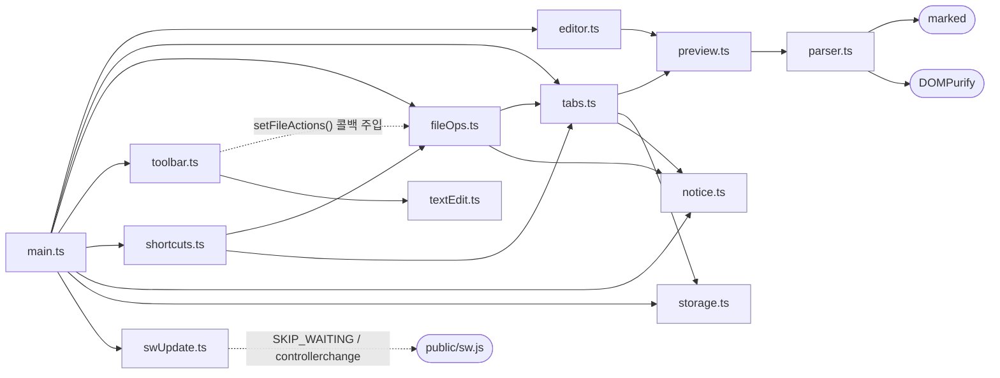

# 상호 관계 매트릭스 — 기능 ↔ 모듈 ↔ 상태 ↔ API ↔ 테스트

> 최종 갱신: 2026-08-12 · 대상: 웹 전환 (v2.0.0)

"어떤 기능이 어떤 코드·상태·API·테스트에 연결되는가" 를 한 장으로 추적한다. 코드를 변경할 때 **영향 범위 파악**과 **갱신할 문서 식별**의 기준점이다.

DB/HTTP API 가 없으므로 축은 **인메모리 상태 ↔ 브라우저 API ↔ UI 모듈**이다. 부재 사유는 [데이터 모델 §1](./data-model.md#1-데이터베이스-현황), [API 명세 §0](../api/browser-apis.md#0-http-api-현황) 참고.

## 1. 기능 ↔ 모듈 ↔ 상태 ↔ 브라우저 API 매트릭스

| ID | 기능 | 트리거 | 모듈 | 읽는/쓰는 상태 | 브라우저 API | E2E 스펙 |
|----|------|--------|------|----------------|--------------|----------|
| F-01 | 실시간 프리뷰 | `#editor` input | `editor.ts` → `preview.ts` → `parser.ts` | (DOM 직독) | — | `editor.spec.ts` |
| F-02 | GFM 렌더링 | 동일 | `parser.ts` (`gfm`,`breaks`) | — | — | `editor.spec.ts`, `parser.test.ts` |
| F-03 | 분할 레이아웃 | 페이지 로드 | `index.html` + `style.css` | — | — | `editor.spec.ts` |
| F-04 | 툴바 16종 | `.toolbar-btn` click | `toolbar.ts` | — | `execCommand` | `toolbar.spec.ts` |
| F-05 | 멀티 탭 | 탭 클릭 / New / 열기 | `tabs.ts` | `tabs`, `activeTabId`, `nextId` | — | `tabs.spec.ts` |
| F-06 | 커서·스크롤 보존 | `switchTab()` | `tabs.ts` | `content`, `scrollTop`, `selection*` | `focus`, `setSelectionRange` | `tabs.spec.ts` |
| F-07 | 파일 열기 | Cmd+O / Open | `shortcuts.ts`·`toolbar.ts` → `fileOps.ts` → `tabs.ts` | `tabs` | `showOpenFilePicker` \| `input[type=file]` | `fileaccess.spec.ts` |
| F-08 | 저장 / 다른 이름으로 | Cmd+S / Shift+Cmd+S / 버튼 | `fileOps.ts` | `handle` 읽기 → `updateActiveTab` | `createWritable` \| `showSaveFilePicker` \| Blob 다운로드 | `fileaccess.spec.ts` |
| F-09 | dirty 마커 | input 이벤트 | `fileOps.ts` → `tabs.markActiveTabDirty()` | `isDirty` | — | `tabs.spec.ts` |
| F-10 | 타이틀 동기화 | 모든 상태 변경 | `tabs.updateTitle()` | `fileName`, `isDirty` | `document.title` | `tabs.spec.ts`, `editor.spec.ts` |
| F-11 | 중복 열기 방지 | 열기 응답 | `fileOps` → `tabs.findTabByHandle()` | `handle` 비교 | `isSameEntry()` | `fileaccess.spec.ts` |
| F-12 | 단축키 | `document` keydown | `shortcuts.ts` | `activeTabId` | `e.key` / `e.code` | `fileaccess.spec.ts`, `tabs.spec.ts` |
| F-14 | 알림 | 저장·열기 결과 | `notice.ts` | — | — | `fileaccess.spec.ts` |
| F-15 | 닫기 확인 / 이탈 경고 | 탭 닫기, 페이지 이탈 | `main.ts`, `tabs.closeTab()` | `isDirty` | `confirm`, `beforeunload` | `tabs.spec.ts` |
| F-18 | HTML sanitize | 프리뷰 렌더 | `parser.ts` | — | DOMPurify | `parser.test.ts`, `editor.spec.ts` |
| F-19 | 세션 자동 저장 | 상태 변경 (500ms) | `tabs.persistNow()` → `storage.ts` | 전 탭 스냅샷 | `localStorage` | `session.spec.ts`, `storage.test.ts` |
| F-20 | 세션 복원 | `initTabs()` | `tabs.restoreSession()` → `storage.ts` | `tabs`, `nextId`, `activeTabId` | `localStorage` | `session.spec.ts` |
| F-52 | CF Workers 배포 | `dev`/`main` push | `wrangler.jsonc`, `deploy.yml` | — | — | `wrangler --dry-run` |
| F-53 | 저장소 불가 안내 | 기동 시 | `main.ts` → `storage.isStorageAvailable()` | — | `localStorage` | `storage.test.ts` |
| F-54 | 저장소 용량 초과 알림 | 세션 저장 실패 | `tabs.persistNow()` → `notice.ts` | — | `localStorage` | `hardening.spec.ts` |
| F-61 | PWA · 오프라인 | 페이지 로드 | `main.ts` 등록 → `public/sw.js` | — | Service Worker, Cache Storage, Manifest | `hardening.spec.ts` |
| F-62 | CSP · 보안 헤더 | 모든 응답 | `public/_headers` (Cloudflare 적용) | — | — | `hardening.spec.ts` (원격 전용) |
| F-69 | 서비스 워커 갱신 알림 | `updatefound` / 로드 시 `waiting` | `main.ts` → `swUpdate.ts` → `public/sw.js` | `reloadPending`, `dismissedWorker` | Service Worker `postMessage`, `controllerchange` | `swupdate.spec.ts`(프리뷰), `swUpdate.test.ts` |

## 2. 모듈 의존 그래프

- **순환 의존 없음.** `toolbar.ts` 는 `fileOps` 를 import 하지 않고 `setFileActions()` 로 콜백을 주입받아 역방향 의존을 끊는다.
- `parser.ts` · `storage.ts` · `notice.ts` · `swUpdate.ts` · `textEdit.ts` 는 다른 앱 모듈에 의존하지 않는 리프다. 이 중 단위 테스트가 붙은 것은 `parser.ts`(100%) · `storage.ts`(91.4%) · `swUpdate.ts`(78.9%) · `textEdit.ts`(신규) — **테스트 용이성과 의존 방향이 정확히 일치한다.** `swUpdate.ts` 는 `SwUpdateHost` 주입, `textEdit.ts` 는 DOM 삽입과 문자열 계산을 분리해 이 성질을 의도적으로 확보했다.

## 3. 상태 필드 ↔ 소비처 역방향 인덱스

| 상태 필드 | 쓰기 | 읽기 | 화면 반영 |
|-----------|------|------|-----------|
| `tabs` (Map) | `createTab`, `closeTab`, `restoreSession` | `renderTabs`, `findTabByHandle`, `switchTab`, `persistNow` | 탭 바 |
| `activeTabId` | `switchTab` | `getActiveTab`, `markActiveTabDirty`, `updateActiveTab`, `syncActiveTab` | `.tab.active` |
| `content` | `syncActiveTab`, `createTab`, `restoreSession` | `switchTab`(복원), `persistNow` | textarea + 프리뷰 |
| `handle` | `createTab`, `updateActiveTab` | `saveFile`, `findTabByHandle` | (저장 경로 분기) |
| `fileName` | `createTab`, `updateActiveTab`, `restoreSession` | `renderTabs`, `updateTitle`, `suggestFileName` | 탭 라벨, 타이틀 |
| `isDirty` | `markActiveTabDirty`, `updateActiveTab`, `restoreSession` | `renderTabs`, `updateTitle`, `closeTab`, `hasDirtyTabs` | `*` 마커, 확인 다이얼로그 |
| `scrollTop` / `selection*` | `syncActiveTab` | `switchTab`(복원) | textarea 커서·스크롤 |
| localStorage 세션 | `persistNow` | `restoreSession` | 재방문 시 전체 화면 |

## 4. 테스트 커버 지도

| 스펙 | 케이스 | 커버 기능 |
|------|--------|-----------|
| `tests/parser.test.ts` | 13 | F-02, F-18 |
| `tests/storage.test.ts` | 9 | F-19, F-20, F-53, F-54 |
| `tests/e2e/urls.spec.ts` | 15 | 배포 자산 무결성 |
| `tests/e2e/editor.spec.ts` | 10 | F-01, F-02, F-03, F-18 |
| `tests/e2e/toolbar.spec.ts` | 16 | F-04, F-16 |
| `tests/e2e/tabs.spec.ts` | 11 | F-05, F-06, F-09, F-10, F-15 |
| `tests/e2e/fileaccess.spec.ts` | 15 | F-07, F-08, F-11, F-12, F-14 |
| `tests/e2e/session.spec.ts` | 6 | F-19, F-20 |
| `tests/e2e/hardening.spec.ts` | 10 | F-54, F-61, F-62 (배포 환경 전용 포함) |
| `tests/e2e/swupdate.spec.ts` | 10 | F-69 (프리뷰 모드 전용 — STUB) |
| `tests/swUpdate.test.ts` | 20 | F-69 |

## 5. 변경 영향도 — "이 파일을 고치면 어떤 문서를 갱신하나"

| 변경 대상 | 갱신해야 할 문서 |
|-----------|------------------|
| `src/parser.ts` (marked 옵션 · sanitize 정책) | [서비스 아키텍처 §3](./service-architecture.md), [API 명세 §8](../api/browser-apis.md#8-보안-노트), `tests/parser.test.ts` |
| `src/tabs.ts` (`TabState` 필드) | [데이터 모델 §2](./data-model.md), 본 문서 §1·§3 |
| `src/storage.ts` (세션 스키마·버전) | [데이터 모델 §3](./data-model.md), [API 명세 §4](../api/browser-apis.md#4-세션-저장-localstorage) |
| `public/_headers` (CSP·캐시) | [인프라 §6.1](./infrastructure.md), [API 명세 §8](../api/browser-apis.md#8-보안-노트), `tests/e2e/hardening.spec.ts` |
| `public/sw.js` (캐시 전략 · 생명주기) | [서비스 아키텍처 §7.1·§7.2](./service-architecture.md), [API 명세 §4.1](../api/browser-apis.md) |
| `src/swUpdate.ts` (`SwUpdateHost` 계약) | [서비스 아키텍처 §7.2](./service-architecture.md), [API 명세 §4.1.3](../api/browser-apis.md), `tests/swUpdate.test.ts` |
| `vite.config.ts` 빌드 ID 플러그인 | [인프라 §3.2](./infrastructure.md), [서비스 아키텍처 §7.2](./service-architecture.md) |
| `playwright.config.ts` 프리뷰 모드 | [테스트 계획 §2](../testing/test-plan.md) |
| `tsconfig.json` · `package.json` build | [인프라 §3.3](./infrastructure.md) |
| `src/fileOps.ts` (파일 I/O 분기) | [API 명세 §2·§3](../api/browser-apis.md), [서비스 아키텍처 §5.3](./service-architecture.md) |
| `src/toolbar.ts` (버튼 증감) | [기능 현황](../features/feature-status.md), `tests/e2e/toolbar.spec.ts` 버튼 개수 단언 |
| `src/textEdit.ts` (감싸기·줄머리·블록 삽입 계산) | `tests/textEdit.test.ts`, `tests/e2e/toolbar.spec.ts` (동작 회귀 게이트) |
| `src/shortcuts.ts` | [API 명세 §5](../api/browser-apis.md#5-키보드-단축키), [사용자 시나리오](../user-scenarios.md), README 단축키 표 |
| `src/notice.ts` | [API 명세](../api/browser-apis.md), `fileaccess.spec.ts` |
| `vite.config.ts` · `wrangler.jsonc` · `.github/workflows/*` | [인프라 아키텍처](./infrastructure.md), [CF Workers 구성](../operations/cloudflare-workers.md) |
| `index.html` (DOM id) | 전 E2E 셀렉터, [서비스 아키텍처 §4](./service-architecture.md) |
| `package.json` scripts | [인프라 §5](./infrastructure.md), README, [테스트 계획](../testing/test-plan.md) |
| 새 의존성 추가 | [인프라 §5](./infrastructure.md), README 기술 스택 표 |

## 6. 관련 문서

- [서비스 아키텍처](./service-architecture.md) · [인프라](./infrastructure.md) · [데이터 모델](./data-model.md)
- [브라우저 API 명세](../api/browser-apis.md)
- [사용자 시나리오](../user-scenarios.md)
- [기능 개발 현황](../features/feature-status.md)
