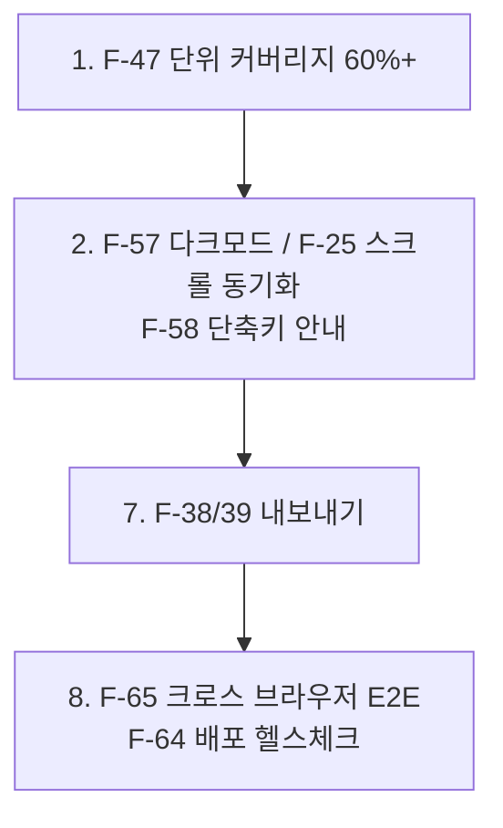

# 기능 개발 현황

> 최종 갱신: 2026-08-12 · 대상: 웹 전환 (v2.0.0)
> 범례: ✅ 구현 완료 · ⚠️ 부분 구현(제약 있음) · ❌ 미구현 · 🗑 제거됨

## 1. 웹 전환으로 해결된 항목

이전 분석(v1.x, 네이티브)에서 결함으로 기록했던 항목들의 현재 상태.

| ID | 항목 | 이전 | 현재 |
|----|------|------|------|
| F-15 | 미저장 문서 닫기 확인 | ❌ 확인 없이 유실 | ✅ `confirm()` + `beforeunload` 이중 방어 |
| F-18 | HTML sanitize | ❌ raw `innerHTML` (XSS) | ✅ DOMPurify 정화 |
| F-14 | 오류 처리 | ⚠️ `console.error` 만 | ✅ 화면 알림(`#notice`) |
| F-08 | 다른 이름으로 저장 | ⚠️ UI 미연결 | ✅ 툴바 버튼 + `Shift+Cmd/Ctrl+S` |
| F-19 | 자동 저장 / 복구 | ❌ 없음 | ✅ localStorage 자동 저장 |
| F-20 | 세션 복원 | ❌ 없음 | ✅ 재방문·새로고침 시 탭 복원 |
| F-41 | CI 파이프라인 | ❌ 없음 | ✅ GitHub Actions (빌드+단위+E2E) |
| F-42 | 코드 서명·공증 | ❌ Gatekeeper 차단 | 🗑 웹은 해당 없음 |
| F-43 | App Sandbox | ❌ 미적용 | 🗑 브라우저 샌드박스로 대체 |
| F-48 | 버전 이원화 | ❌ package.json ↔ Info.plist | ✅ `package.json` 단일화 (2.0.0) |
| F-49 | 새 문서 만들기 | ❌ 파일을 열어야만 탭 생성 | ✅ New 버튼 + `Alt+N` |
| F-50 | 툴바 파일 액션이 문서를 dirty 로 표시 | ❌ 버그 (당시 미발견) | ✅ `editsText` 플래그로 수정 |
| F-51 | 탭 전환 시 커서 위치 복원 | ⚠️ 미검증 | ✅ focus 복원 후 selection 복원 |
| F-31 | 반응형 레이아웃 | ❌ 없음 | ✅ 720px 이하에서 상하 분할 |

## 2. 구현 완료 (✅)

| ID | 기능 | 근거 | 검증 |
|----|------|------|------|
| F-01 | 실시간 마크다운 프리뷰 (150ms 디바운스) | `editor.ts` | E2E |
| F-02 | GFM 렌더링 (테이블·취소선·체크리스트·breaks) | `parser.ts` | 단위 + E2E |
| F-03 | 좌우 분할 레이아웃 (+ 모바일 상하 분할) | `style.css` | E2E |
| F-04 | 툴바 16종 (New·Open·Save·Save As + 서식 12) | `toolbar.ts` | E2E 16케이스 |
| F-05 | 멀티 탭 (생성·전환·닫기·마지막 탭 자동 재생성) | `tabs.ts` | E2E 11케이스 |
| F-06 | 탭별 본문·커서·스크롤 보존 | `tabs.ts switchTab()` | E2E |
| F-07 | 파일 열기 (FS Access + 업로드 폴백) | `fileOps.ts` | E2E 목 기반 |
| F-08 | 저장 / 다른 이름으로 저장 | `fileOps.ts` | E2E |
| F-09 | 변경 표시 `*` (탭 + 타이틀) | `tabs.ts` | E2E |
| F-10 | 타이틀 동기화 | `tabs.ts updateTitle()` | E2E |
| F-12 | 단축키 (Cmd/Ctrl+O·S, Shift+S, Alt+N·W) | `shortcuts.ts` | E2E |
| F-14 | 사용자 대상 오류·성공 알림 | `notice.ts` | E2E |
| F-15 | 미저장 닫기 확인 + 이탈 경고 | `main.ts`, `tabs.ts` | E2E |
| F-16 | undo 스택 보존형 삽입 (`execCommand`) | `toolbar.ts` | E2E(간접) |
| F-18 | HTML sanitize | `parser.ts` | 단위 6 + E2E 2 |
| F-19 | 세션 자동 저장 | `storage.ts`, `tabs.ts` | 단위 8 + E2E |
| F-20 | 세션 복원 | `tabs.ts restoreSession()` | E2E 6케이스 |
| F-31 | 반응형 레이아웃 | `style.css` | 수동 |
| F-41 | CI 파이프라인 | `.github/workflows/ci.yml` | — |
| F-52 | Cloudflare Workers 배포 (dev/prod) | `wrangler.jsonc`, `ci.yml` deploy 잡 | **실배포 성공** (dev·prod) |
| F-63 | prod 커스텀 도메인 `md-editor.devworld.co.kr` | `wrangler.jsonc` `routes` | **실서비스 중** + prod E2E 58건 |
| F-53 | 저장소 사용 불가 환경 안내 | `main.ts`, `storage.ts` | 단위 |
| F-66 | `main`·`dev` 브랜치 보호 규칙 | GitHub branch protection | 직접 push 거부 확인 |
| F-62 | CSP 및 보안 헤더 | `public/_headers` | E2E 3케이스 (배포 환경) |
| F-54 | 저장소 용량 초과 알림 | `tabs.ts persistNow()` | 단위 1 + E2E 2 |
| F-61 | PWA (manifest · 서비스 워커 · 오프라인) | `public/manifest.webmanifest`, `public/sw.js` | E2E 4케이스 |
| F-69 | 서비스 워커 업데이트 알림 | `src/swUpdate.ts`, `public/sw.js`, `vite.config.ts` | 단위 20 + E2E STUB 10 |
| F-64 | 배포 후 자동 헬스체크 | `scripts/healthcheck.sh`, `ci.yml` | 성공·실패 양쪽 확인 |
| F-70 | 오프라인 상태 표시 | `src/offline.ts` | 단위 7 + E2E 3 |
| F-71 | 갱신 알림 P2 4건 정리 | `src/swUpdate.ts` | 단위 44 |
| F-58 | 브라우저별 기능 한계 안내 | `src/fsLimitNotice.ts` | 단위 + E2E 5 |
| F-25 | 에디터 ↔ 프리뷰 스크롤 동기화 (양방향) | `src/scrollSync.ts` | 단위 27 + E2E 11 |
| F-72 | 편집/프리뷰 영역 시각 구분 | `src/style.css` 토큰 3종 | E2E |
| F-57 | 다크 모드 (`prefers-color-scheme`) | `src/style.css` 토큰 7종 | E2E 6 |
| F-68 | PWA 아이콘 PNG (`apple-touch-icon` · maskable) | `scripts/gen-icons.mjs`, `public/*.png` | E2E 7 |
| F-58 (완결) | 단축키 안내 UI | `src/shortcutDefs.ts`, `src/shortcutHelp.ts` | 단위 30 + E2E 11 |
| F-22 | 문서 내 검색 · 치환 | `src/searchEngine.ts`, `src/search.ts` | 단위 58 + E2E 23 |
| F-32 | 분할 비율 조절 (드래그 · 키보드) | `src/splitLayout.ts`, `src/splitter.ts` | 단위 36 + E2E 10 |
| F-33 | 분할 / 편집 전용 / 미리보기 전용 모드 | `src/viewMode.ts` | 단위 13 + E2E 12 |
| F-38 | HTML 내보내기 (독립 실행 파일) | `src/htmlExport.ts`, `fileOps.exportFile()` | 단위 18 + E2E 7 |
| F-39 | 인쇄 / PDF (인쇄 전용 스타일) | `src/style.css` `@media print` | E2E 9 |
| F-59 | 접근성 정밀 점검 (axe + 수동 시나리오) | `index.html`, `src/tabs.ts`, `src/style.css` | E2E 18 |
| F-34 | 탭 드래그·키보드 재정렬 | `src/tabOrder.ts`, `src/tabs.ts` | 단위 18 + E2E 11 |
| F-35 | 편집 글꼴·글자 크기 설정 | `src/editorPrefs.ts`, `src/editorSettings.ts` | 단위 23 + E2E 12 |
| F-36 | 최근 파일 목록 (핸들 수명 안내 포함) | `src/recentFiles.ts`, `src/recentFilesUi.ts` | 단위 31 + E2E 12 |

## 3. 부분 구현 (⚠️)

| ID | 기능 | 구현된 부분 | 제약 | 영향 |
|----|------|-------------|------|------|
| F-11 | 중복 파일 열기 방지 | FS Access 경로에서 `isSameEntry()` 로 판별 | **폴백 브라우저(Safari·Firefox)에서는 불가** — 핸들이 없어 같은 파일이 여러 탭으로 열린다 | 중 |
| F-08 | 덮어쓰기 저장 | Chrome·Edge 에서 대화상자 없이 덮어쓰기 | **폴백 브라우저에서는 매번 새 파일 다운로드** | 중 |
| F-19 | 자동 저장 | 500ms 디바운스 저장 + **용량 초과 시 사용자 알림**(F-54) | 초과 이후에는 자동 저장이 멈춘 상태로 유지된다. 오래된 탭을 자동 정리하는 회수 로직은 없다 | 낮 |
| F-20 | 세션 복원 | 탭·본문·dirty·활성 탭 복원 | 파일 핸들·커서·스크롤은 복원 불가 (구조적 한계) | 낮 |
| F-06 | 커서·스크롤 보존 | 탭 전환 시 복원, E2E 로 커서 검증 | `scrollTop` 복원은 미검증 (textarea 높이 의존) | 낮 |

## 4. 미구현 (❌)

### 4.1 데이터 안전성

| ID | 기능 | 현재 |
|----|------|------|
| F-21 | 외부 파일 변경 감지 | 다른 편집기에서 같은 파일을 수정해도 모른 채 덮어쓴다 |
| F-55 | 세션 스키마 마이그레이션 | v2 도입 시 기존 세션은 폐기됨 |

### 4.2 에디터 기능

| ID | 기능 |
|----|------|
| F-23 | 구문 하이라이팅 (에디터·코드 블록 모두) |
| F-24 | 줄 번호 표시 |
| F-26 | 리스트 자동 이어쓰기 (Enter 시 `- ` 삽입) |
| F-27 | Tab 키 들여쓰기 (현재 포커스 이동) |
| F-28 | 이미지 드래그앤드롭 · 붙여넣기 |
| F-29 | 문서 통계 (단어·문자·읽기 시간) |
| F-30 | 표 편집 보조 |
| F-56 | 마크다운 파일 드래그앤드롭으로 열기 |

### 4.3 UI / UX

| ID | 기능 |
|----|------|

### 4.4 내보내기 / 공유

| ID | 기능 |
|----|------|
| F-40 | 렌더된 HTML 클립보드 복사 |
| F-60 | 공유 링크 (문서 퍼블리시) — 서버 도입 필요 |

### 4.5 웹 플랫폼

| ID | 기능 | 비고 |
|----|------|------|
| F-67 | dev 환경 커스텀 도메인 | dev 는 `*.workers.dev` |

### 4.6 엔지니어링

| ID | 항목 | 현황 |
|----|------|------|
| F-45 | 린터 / 포매터 (ESLint·Prettier) | 설정 없음 |
| F-47 | 단위 테스트 커버리지 | ✅ **73.78% 달성**(목표 60%) — [커버리지 분석](../testing/coverage.md). `fileOps.ts` 89.77% 포함. 남은 0%: `toolbar.ts`·`main.ts`(E2E 담당) |
| F-65 | 크로스 브라우저 E2E (Firefox·WebKit 프로젝트) | Chromium 만 실행 |

## 5. 제거됨 (🗑)

| 항목 | 사유 |
|------|------|
| macOS 네이티브 앱 (`MarkupEditorApp/`) | 웹 전용 전환 |
| `build.sh` (웹+Xcode 통합 빌드) | 동일 |
| `MarkdownEditor.dmg` (2.1MB) | 동일 |
| JS↔Swift 브리지 (`window.webkit`, `window._bridge`) | 동일 — `fileOps.ts` 가 브라우저 API 로 재작성됨 |
| `app://` 커스텀 스킴 (`BundleSchemeHandler`) | 동일 |
| `TabState.filePath` | FS Access API 가 경로를 노출하지 않음 → `handle` 로 대체 |
| `Cmd+W` 탭 닫기 | 브라우저가 선점 → `Alt+W` 로 이동 |
| Vite 의 `base:"./"`·`modulePreload:false` | `app://` 호환 목적이었음 |

이전 구현은 커밋 `a9d93ca` 이하에 보존되어 있다.

## 6. 권장 개발 순서

### 즉시 조치 권장

1. **F-68** — PWA 아이콘이 SVG 단일이라 iOS 홈 화면 추가 시 품질이 떨어진다.
2. **F-58 잔여** — 단축키 안내 UI. 웹은 메뉴바가 없어 `Alt+N`·`Alt+W` 같은 비표준 조합의 발견성이 특히 낮다.
3. **F-25 / F-22** — 스크롤 동기화, 문서 내 검색. 편집 경험의 다음 단계.

## 7. 관련 문서

- [사용자 시나리오](../user-scenarios.md)
- [상호 관계 매트릭스](../architecture/traceability.md)
- [테스트 커버리지 분석](../testing/coverage.md)
- [웹 전환 히스토리](../history/2026-08-12-web-pivot.md)
