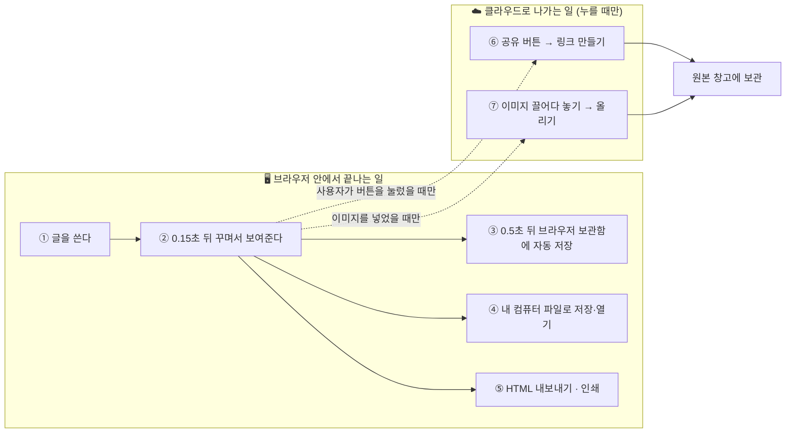
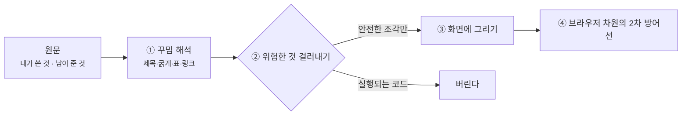
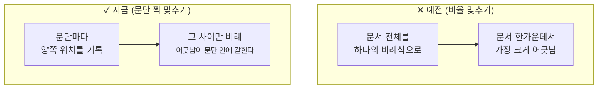
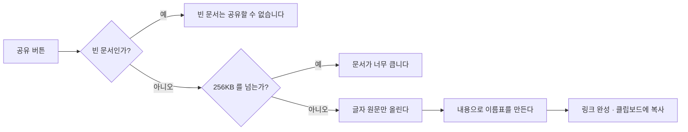
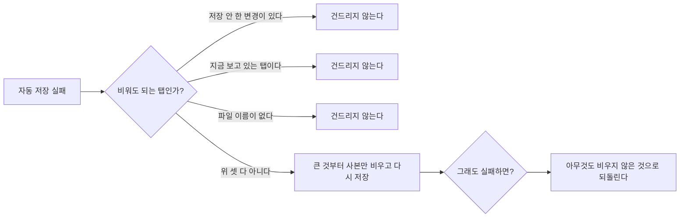

> 최종 갱신: 2026-08-14 · 대상: v2.x
>
> **이 문서는 개발 지식이 없는 사람을 위한 것입니다.** 이 서비스가 무엇을 해 주고, 그 일이 어디서 벌어지며, 왜 그렇게 만들었는지를 그림으로 설명합니다.
> 개발자용 문서는 따로 있습니다 — [서비스 아키텍처](./architecture/service-architecture.md) · [데이터 모델](./architecture/data-model.md) · [브라우저 API 명세](./api/browser-apis.md).
>
> **코드와 이 문서가 어긋나면 코드가 맞습니다.** 근거로 읽은 파일은 맨 끝 [근거](#근거) 절에 적어 두었습니다.

# 마크다운 에디터는 어떻게 동작하나

글을 왼쪽에 쓰면 오른쪽에 **꾸며진 결과가 바로 보이는** 편집기입니다. 웹 주소만 열면 되고, 설치할 것이 없습니다.

한 문장으로 줄이면 이렇습니다:

> **문서는 당신의 컴퓨터에 있습니다.** 공유 버튼을 누를 때만 밖으로 나갑니다.

---

## 01 · 일이 어디서 벌어지나

**경계를 한 번도 넘지 않는 일이 대부분입니다.** 쓰고·보고·저장하고·내보내고·인쇄하는 동안 이 서비스는 인터넷에 아무것도 보내지 않습니다. 밖으로 나가는 길은 **공유**와 **이미지 넣기** 둘뿐이고, 둘 다 사용자가 그 버튼을 눌러야 시작합니다.

공유를 쓰지 않는 사용자에게 네트워크 요청이 **한 건도 없다**는 것을 자동 검사가 매번 확인합니다.

| 자동 저장과 파일 저장은 다른 일입니다 | |
|---|---|
| **브라우저 보관함**(자동, 0.5초마다) | 실수로 창을 닫아도 돌아오기 위한 **안전망**. 이 브라우저에서만 보입니다 |
| **내 컴퓨터 파일**(직접 저장) | 진짜 원본. 다른 기기로 옮기거나 백업할 수 있습니다 |

---

## 02 · 남이 만든 문서를 열어도 안전한 이유

공유 링크로 받은 글, 끌어다 놓은 파일, 붙여넣은 텍스트는 **내가 쓰지 않은 글**입니다. 그런 글에는 화면을 조작하려는 코드가 숨어 있을 수 있습니다.

**화면에 글을 그리는 길이 하나뿐입니다.** 프리뷰도, 내보낸 HTML 파일도, 인쇄물도 전부 이 길을 지납니다. 길이 둘이면 한쪽만 고쳐 두고 뚫리는 사고가 나기 때문에, 두 번째 길을 만들지 않는 것을 규칙으로 삼았습니다.

②를 통과한 뒤에도 브라우저에게 "이 페이지에서는 외부 코드를 실행하지 말라"고 한 번 더 못을 박습니다. 걸러내기가 뚫리는 경우를 대비한 **두 번째 잠금장치**입니다.

---

## 03 · 스크롤이 따라오는 방식을 바꾼 이야기

왼쪽을 내리면 오른쪽도 따라 내려갑니다. 처음에는 **스크롤 막대의 위치 비율**을 맞췄습니다. 숫자는 정확히 비례했지만, 정작 **보이는 내용이 어긋났습니다.**

같은 글이라도 양쪽의 높이가 다르기 때문입니다.

| 원문 한 줄 | 왼쪽(편집) | 오른쪽(결과) |
|---|---|---|
| `# 큰 제목` | 그냥 한 줄 | 큰 글씨 + 위아래 여백 |
| 코드 상자 | 적은 그대로 | 배경과 여백이 붙은 상자 |
| 표 | 적은 줄 수 | 칸 높이에 따라 달라짐 |

그래서 **문단마다 짝을 지어** 맞추는 방식으로 바꿨습니다.

실제로 재 보니 짝이 지어진 지점에서는 **어긋남이 0** 이었습니다.

짝을 지을 수 없는 문서(문단이 하나뿐이거나, 각주처럼 원문에 없던 덩어리가 결과에만 생기는 경우)에는 **예전 방식으로 조용히 되돌아갑니다.** 틀린 짝으로 맞추면 스크롤이 제멋대로 튀어서, 안 맞추느니만 못하기 때문입니다.

---

## 04 · 공유 링크는 무엇을 밖으로 보내나

밖으로 나가는 것은 **글자 원문뿐입니다.** 꾸며진 화면을 보내지 않는 이유는 02 절과 같습니다 — 공유받은 사람의 브라우저에서도 **같은 걸러내기 길**을 지나야 하기 때문입니다.

링크의 이름표는 **문서 내용에서 계산**합니다. 그래서 성질이 셋 생깁니다.

| 성질 | 뜻 |
|---|---|
| 같은 문서 = 같은 링크 | 다시 공유해도 링크가 바뀌지 않고, 같은 글이 두 번 저장되지 않습니다 |
| 고칠 수도 지울 수도 없음 | 읽기 전용입니다. 고치려면 새로 공유하면 되고, 그때 새 링크가 나옵니다 |
| **이름표는 비밀이 아님** | 내용을 아는 사람은 링크를 계산할 수 있습니다. **"아는 사람만 본다" 수준의 보호**이고, 그 이상이 필요하면 이 기능을 쓰면 안 됩니다 |

이미지도 같은 방식입니다. 다만 **그림 파일만** 받습니다 — 그림처럼 보이지만 실행되는 코드를 품을 수 있는 형식(SVG)은 아예 거절합니다. 헤더 설정으로 막을 수도 있지만, 설정 한 줄이 빠지면 조용히 뚫립니다. 처음부터 받지 않으면 그 경로가 존재하지 않습니다.

---

## 05 · 저장 공간이 꽉 찼을 때

브라우저 보관함에는 한도가 있습니다. 예전에는 한도를 넘으면 **자동 저장이 멈춘 채로 유지**됐습니다.

지금은 공간을 벌어서 다시 저장합니다. 다만 **무엇을 비워도 되는지**를 아주 좁게 정했습니다.

**비우는 것은 '저장된 사본'뿐이고, 화면에 떠 있는 글은 그대로입니다.** 그래서 이번 세션에서는 아무것도 잃지 않습니다. 비운 사본은 조건상 **디스크 파일과 같은 내용**이라, 파일을 다시 열면 되찾습니다. 탭 자체도 닫지 않습니다 — 사용자가 열어 둔 것이니까요.

다 비워도 저장이 안 되면 **회수하지 않은 것으로 보고**합니다. 공간도 못 벌면서 사본만 잃는 최악을 피하기 위해서입니다.

---

## 06 · 등장인물

| 이름 | 사는 곳 | 하는 일 |
|---|---|---|
| **편집 화면** | 사용자의 브라우저 | 글을 쓰고, 0.15초 뒤 결과를 다시 그립니다 |
| **브라우저 보관함** `localStorage` | 사용자의 브라우저 | 열려 있는 탭과 내용을 0.5초마다 자동 저장합니다 |
| **내 컴퓨터 파일** | 사용자의 디스크 | 진짜 원본. 브라우저 종류에 따라 저장 방식이 조금 다릅니다 |
| **클라우드** Cloudflare Workers | 전 세계 클라우드 | 앱을 내려주고, 공유·이미지 요청 두 가지만 처리합니다 |
| **원본 창고** Cloudflare R2 | 클라우드 | 공유된 문서 원문과 올린 이미지를 보관합니다 |
| **오프라인 도우미** Service Worker | 사용자의 브라우저 | 인터넷이 끊겨도 앱이 열리게 하고, 새 버전이 나오면 알려줍니다 |

### 핵심 숫자

| 값 | 얼마 | 왜 그 값인가 |
|---|---|---|
| 결과 다시 그리기 | 0.15초 | 타이핑을 방해하지 않으면서 즉시 반응하는 것처럼 느껴지는 선 |
| 자동 저장 | 0.5초 | 더 자주 하면 큰 문서에서 느려지고, 더 뜸하면 잃는 양이 늘어납니다 |
| 공유 문서 최대 | 256KB | 누구나 올릴 수 있는 창구라 상한이 필요합니다. 이 앱이 다루는 문서보다 훨씬 큽니다 |
| 이미지 최대 | 2MB | 같은 이유 |
| 링크 이름표 | 16자리 | 서로 다른 문서가 같은 링크를 가질 확률이 사실상 0 |
| 밖에서 가져다 쓰는 코드 | **2개** | 기능을 80여 개 더하는 동안 그대로입니다 |
| 자동 검사 | **1,243건 통과** | 사람이 매번 확인할 수 없는 것들을 대신 봅니다 (원격 환경 전용 15건 제외) |

---

## 07 · 일부러 "조용히 넘어가지 않게" 만든 것들

이 프로젝트에서 가장 조심한 것은 **틀렸는데도 아무 일 없어 보이는 상태**입니다. 그런 자리에는 일부러 즉시 실패하도록 만들어 두었습니다.

| 자리 | 그냥 두면 | 그래서 |
|---|---|---|
| 새 버전 표시 | 배포해도 사용자 화면이 안 바뀌는데 **아무도 모릅니다** | 버전 표시가 빠지면 **빌드를 실패**시킵니다 |
| 공유·이미지 창구 | 앱 화면이 대신 응답해 **절반만 동작**한 적이 있습니다(실제 사고) | 배포할 때마다 **실제로 한 번 왕복**시켜 확인합니다 |
| 스크롤 짝 맞추기 | 짝이 어긋난 채로 맞추면 스크롤이 튑니다 | 개수가 안 맞으면 **포기하고 예전 방식**으로 |
| 저장 공간 회수 | 공간도 못 벌고 사본만 잃을 수 있습니다 | 끝내 실패하면 **아무것도 비우지 않은 것으로** 되돌립니다 |
| 그림 업로드 | 그림인 척하는 실행 파일이 우리 주소를 갖게 됩니다 | 그런 형식은 **처음부터 받지 않습니다** |
| 표 정렬 | 한글·이모지는 폭이 달라 글자 수로 맞추면 더 어긋납니다 | **보이는 폭**으로 계산합니다 |
| 화면에 그리는 길 | 길이 둘이면 한쪽만 고쳐 두고 뚫립니다 | **길을 하나만** 유지합니다 |

검사를 새로 추가할 때는 **일부러 코드를 망가뜨려 그 검사가 실제로 실패하는지** 확인합니다. 통과하는 검사가 사실은 아무것도 보고 있지 않은 경우를 실제로 여러 번 발견했기 때문입니다.

---

## 근거

이 문서의 모든 숫자와 흐름은 아래에서 읽었습니다. 값이 바뀌면 여기부터 다시 읽습니다.

| 무엇 | 어디 |
|---|---|
| 배포 구성 · 창구 경로 · 저장소 연결 | `wrangler.jsonc` |
| 공유·이미지 규칙과 상한 | `src/shareId.ts`, `src/imageUpload.ts`, `worker/index.ts` |
| 화면에 그리는 길 | `src/parser.ts`, `public/_headers` |
| 자동 저장·회수 규칙 | `src/storage.ts`, `src/tabs.ts`, `src/sessionReclaim.ts` |
| 스크롤 짝 맞추기 | `src/scrollAnchors.ts`, `src/sourceLines.ts`, `src/scrollSync.ts` |
| 오프라인·새 버전 알림 | `public/sw.js`, `vite.config.ts` |
| 기능 목록 · 검사 건수 | [기능 개발 현황](./features/feature-status.md), [테스트 실행 결과](./testing/test-results.md) |
| 배포 확인 절차 | `scripts/healthcheck.sh` |
