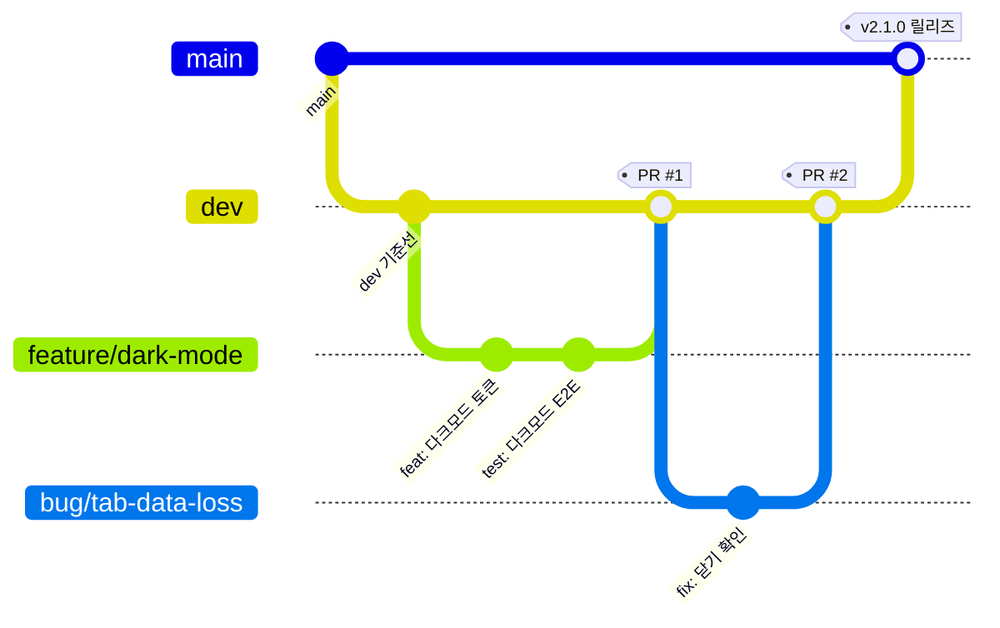

# 브랜치 전략

> 최종 갱신: 2026-08-12 · 대상: 웹 전환 (v2.0.0)

## 1. 브랜치 구조

```
feature/*  ─┐
             ├─→ dev ─→ main
bug/*      ─┘
```

| 브랜치 | 역할 | 보호 | 배포 대상 |
|--------|------|------|-----------|
| `main` | 릴리즈 기준. 항상 배포 가능한 상태 | 직접 push 금지, PR 필수 | prod (`markdown-editor-prod`) |
| `dev` | 통합 브랜치. 기능·버그 수정이 먼저 모이는 곳 | 직접 push 금지, PR 필수 | dev (`markdown-editor-dev`) |
| `feature/*` | 신규 기능 개발 | — | local |
| `bug/*` | 버그 수정 | — | local |

push 시 배포는 `.github/workflows/deploy.yml` 이 자동 수행한다. 상세: [Cloudflare Workers 구성](./cloudflare-workers.md)

## 2. 현재 저장소 상태

| 항목 | 값 |
|------|-----|
| 존재하는 브랜치 | `main` 만 |
| `dev` 브랜치 | **미생성** |
| 존재하는 브랜치 | `main`, `dev` |
| 브랜치 보호 규칙 | ✅ `main`·`dev` 모두 적용 (§6) |
| CI/CD 워크플로 | ✅ `ci.yml` (`verify` → `deploy`) 운영 중 |
| 릴리즈 이력 | PR #1 (v2.0.0 웹 전환), PR #2 (릴리즈 기록·스택 프로필) |

전략이 실제로 강제되고 있다. `main`·`dev` 모두 직접 push 가 거부된다.

## 3. 명명 규칙

| 유형 | 패턴 | 예시 |
|------|------|------|
| 기능 | `feature/<요약>` 또는 `feature/issue-<번호>` | `feature/dark-mode`, `feature/issue-42` |
| 버그 | `bug/<요약>` 또는 `bug/issue-<번호>` | `bug/tab-close-data-loss` |
| 긴급 수정 | `hotfix/<요약>` (main 에서 분기, main·dev 양쪽 병합) | `hotfix/crash-on-open` |

## 4. 커밋 메시지 규칙

```
<type>: <한글 설명>
```

| type | 용도 |
|------|------|
| `feat` | 신규 기능 |
| `fix` | 버그 수정 |
| `docs` | 문서만 변경 |
| `refactor` | 동작 변화 없는 구조 개선 |
| `test` | 테스트 추가/수정 |
| `chore` | 빌드·설정·의존성 |

예: `feat: 미저장 문서 닫기 확인 다이얼로그 추가`

## 5. 워크플로



> **보호 규칙 적용 후에는 `dev` 에도 직접 push 할 수 없다.** 문서 한 줄 수정이라도
> `feature/*` 브랜치 → PR → 머지 경로를 거쳐야 한다.

### 5.1 기능 개발 절차

1. `dev` 최신화 후 `feature/<요약>` 분기
2. 구현 + 테스트 추가 (`tests/` 또는 `tests/e2e/`)
3. 로컬 게이트 통과 확인 (CI 와 동일한 3종)
   ```bash
   npm run build          # tsc 타입 검사 포함
   npm run test:coverage  # 단위
   npm run test:e2e       # E2E
   ```
4. 코드 변경에 대응하는 문서 갱신 ([문서 동기화 규칙](#7-문서-동기화-규칙))
5. `feature/*` → `dev` PR 생성 · 리뷰 · 병합
6. 병합 후 feature 브랜치 삭제

### 5.2 릴리즈 절차 (`dev` → `main`)

1. dev 환경(`markdown-editor-dev`)에서 실제 동작 확인
2. [수동 회귀 체크리스트](../testing/test-plan.md#7-수동-회귀-체크리스트-릴리즈-전) 수행 — 특히 Chrome/Safari 파일 기능 차이
3. `package.json` `version` 갱신 (버전 단일 출처)
4. `dev` → `main` PR 생성 · 병합
5. Actions 가 prod(`markdown-editor-prod`)로 자동 배포
6. `main` 에 태그 부여 (`v2.1.0`)
7. https://md-editor.devworld.co.kr 접속해 스모크 확인

네이티브 앱 시절의 `build.sh` · DMG · 코드 서명 단계는 웹 전환과 함께 사라졌다.

### 5.3 긴급 수정 절차

`main` 에서 `hotfix/*` 분기 → 수정 → `main` 병합 + 태그 → **`dev` 에도 반드시 병합**(누락 시 다음 릴리즈에서 회귀).

## 6. 브랜치 보호 규칙 (적용 완료)

`main` 과 `dev` 에 동일 규칙을 적용했다 (2026-08-12).

| 항목 | 값 | 의미 |
|------|-----|------|
| PR 필수 | ✅ | 직접 push 거부 (`GH006: Protected branch update failed`) |
| 필요 승인 수 | **0** | 메인테이너가 1명이라 1 이상이면 자기 PR 을 승인할 수 없어 머지가 영구 차단된다 |
| 필수 상태 체크 | `verify` | 빌드 + 단위 + E2E. **`deploy` 는 넣지 않는다** — PR 에서 skip 되므로 필수로 걸면 영구 대기 상태가 된다 |
| strict (최신화 강제) | `false` | 머지 커밋 때문에 `dev` 가 항상 `main` 보다 뒤처져 매번 동기화가 필요해진다. PR 체크는 이미 base+head 병합 결과에서 돌므로 실익이 적다 |
| 관리자에도 적용 | ✅ | 소유자도 우회 불가 |
| 강제 push | ❌ 금지 | 히스토리 훼손 방지 |
| 브랜치 삭제 | ❌ 금지 | `dev`/`main` 실수 삭제 방지 |

### 적용 명령

```bash
gh api -X PUT repos/OWNER/REPO/branches/main/protection --input protection.json
gh api -X PUT repos/OWNER/REPO/branches/dev/protection  --input protection.json
```

### 긴급 상황 우회

관리자에도 적용되므로 우회하려면 규칙을 **일시 해제**해야 한다.

```bash
gh api -X DELETE repos/OWNER/REPO/branches/main/protection   # 해제
# 조치 후 위 PUT 으로 재적용
```

### 남은 준비 작업

- [ ] 기본 브랜치를 `dev` 로 변경 (PR 기본 타깃)
- [ ] 승인 1명 필수로 상향 (협업자가 2명 이상 활동할 때)
- [x] CI/CD 워크플로 (`ci.yml`: `verify` → `deploy`)
- [x] `CLOUDFLARE_API_TOKEN` · `CLOUDFLARE_ACCOUNT_ID` 시크릿 등록
- [x] `MarkdownEditor.dmg` 를 Git 추적에서 제거

## 7. 문서 동기화 규칙

코드 변경 시 어떤 문서를 갱신해야 하는지는 [상호 관계 매트릭스 §5](../architecture/traceability.md#5-변경-영향도--이-파일을-고치면-어떤-문서를-갱신하나) 의 영향도 표를 기준으로 판단한다. PR 체크리스트에 다음 항목을 포함한다.

- [ ] 기능 추가/삭제 → [기능 개발 현황](../features/feature-status.md) 갱신 (F-ID 부여)
- [ ] 브라우저 API 사용 변경 → [API 명세](../api/browser-apis.md) 갱신
- [ ] `TabState` · 세션 스키마 변경 → [데이터 모델](../architecture/data-model.md) 갱신
- [ ] 배포 설정 변경 → [CF Workers 구성](./cloudflare-workers.md) · [인프라](../architecture/infrastructure.md) 갱신
- [ ] 테스트 추가/수정 → [테스트 계획](../testing/test-plan.md) · [결과](../testing/test-results.md) 갱신
- [ ] 작업 완료 → [히스토리](../history/README.md) 에 항목 추가

## 8. 관련 문서

- [Cloudflare Workers 구성](./cloudflare-workers.md) — 브랜치 ↔ 환경 매핑
- [인프라 아키텍처](../architecture/infrastructure.md)
- [작업 히스토리](../history/README.md)
