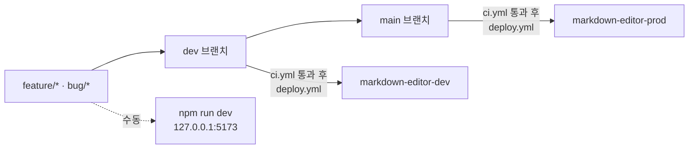

# Cloudflare Workers 구성

> 최종 갱신: 2026-08-12 · 상태: **적용됨 (v2.0.0)**
> 이전 버전에서는 "미적용 설계안" 이었다. 웹 전환과 함께 실제로 도입했다.

## 1. 개요

정적 자산 전용 Worker 로 `dist/` 를 서빙한다. 서버 코드(`main` 엔트리)가 없으므로 콜드 스타트와 요청당 실행 비용이 사실상 없다.

| 항목 | 값 |
|------|-----|
| 설정 파일 | `wrangler.jsonc` |
| Worker 유형 | Static Assets (server-less) |
| `compatibility_date` | `2026-08-12` |
| 관측 | `observability.enabled = true` |
| 404 처리 | `single-page-application` (알 수 없는 경로 → `index.html`) |

## 2. 환경 매핑

| 환경 | 소스 브랜치 | 배포 트리거 | Worker 이름 | `APP_ENV` | 데이터베이스 |
|------|-------------|-------------|-------------|-----------|--------------|
| **local** | 작업 브랜치 | `npm run dev` / `npm run cf:dev` | — | — | 없음 |
| **dev** | `dev` | `dev` push → GitHub Actions | `markdown-editor-dev` | `dev` | 없음 |
| **prod** | `main` | `main` push → GitHub Actions | `markdown-editor-prod` | `prod` | 없음 |

prod 접근 URL: **https://md-editor.devworld.co.kr** · dev 접근 URL: **https://md-editor-dev.devworld.co.kr** (F-67)

`markdown-editor-dev.*.workers.dev` 도 계속 동작한다 — 인증서 프로비저닝 중이거나 DNS 문제가 있을 때 기댈 곳이 필요해 `workers_dev: true` 로 명시해 두었다.



> **데이터베이스 없음** — 조직 표준 워크플로는 환경별 Supabase(local/dev/prod) 를 전제하지만, 이 앱은 문서를 서버로 보내지 않는다. 모든 데이터는 사용자 브라우저와 로컬 디스크에만 존재한다 ([데이터 모델](../architecture/data-model.md)). DB 가 필요해지는 시나리오는 §6 참고.

## 3. 설정 (`wrangler.jsonc`)

```jsonc
{
  "name": "markdown-editor",
  "compatibility_date": "2026-08-12",
  "observability": { "enabled": true },
  "assets": {
    "directory": "./dist",
    "not_found_handling": "single-page-application"
  },
  "env": {
    "dev": {
      "name": "markdown-editor-dev",
      "assets": { "directory": "./dist", "not_found_handling": "single-page-application" },
      "vars": { "APP_ENV": "dev" }
    },
    "prod": {
      "name": "markdown-editor-prod",
      "assets": { "directory": "./dist", "not_found_handling": "single-page-application" },
      "vars": { "APP_ENV": "prod" },
      "routes": [{ "pattern": "md-editor.devworld.co.kr", "custom_domain": true }]
    }
  }
}
```

> `env.*` 블록은 최상위 설정을 상속하지 않는 항목이 있어 `assets` 를 환경마다 명시한다.

### 3.1 `_headers`

`public/_headers` 가 `dist/_headers` 로 복사되어 Cloudflare Workers Static Assets 가 응답 헤더로 적용한다. CSP·보안 헤더·캐시 정책이 여기 있다 — [인프라 §6.1](../architecture/infrastructure.md#61-보안-헤더-public_headers).

개발 서버(vite)는 이 파일을 무시하므로 **헤더 검증 E2E 는 원격 baseURL 일 때만 실행**된다.

## 4. 배포

### 4.1 수동

```bash
npm run deploy:dev     # build + wrangler deploy --env dev
npm run deploy:prod    # build + wrangler deploy --env prod
npm run cf:dev         # 로컬 workerd 런타임으로 dist/ 서빙
```

### 4.2 자동 (GitHub Actions)

`.github/workflows/ci.yml` 의 `deploy` 잡 — `dev`/`main` push 시 실행.

- `needs: verify` — **테스트를 통과한 커밋만 배포된다**
- `concurrency: ci-${{ github.ref }}` + `cancel-in-progress` 로 같은 브랜치의 중복 실행 취소
- GitHub Environment 를 `dev`/`prod` 로 분리해 승인 규칙·시크릿을 환경별로 관리 가능
- `npx wrangler deploy` 직접 호출 (`cloudflare/wrangler-action` 은 wrangler 3.x 를 번들해
  `wrangler.jsonc` 를 읽지 못하므로 사용하지 않는다)

### 4.3 검증

```bash
npx wrangler deploy --env dev --dry-run
```

실제 배포 없이 설정 파싱·자산 수집·바인딩을 확인한다. 2026-08-12 실행 결과: 자산 5개 인식, `env.APP_ENV ("dev")` 바인딩 확인.

## 5. 필요한 시크릿

| 키 | 저장 위치 | 용도 |
|----|-----------|------|
| `CLOUDFLARE_API_TOKEN` | GitHub Actions Secrets | 배포 권한 (Workers Scripts:Edit) |
| `CLOUDFLARE_ACCOUNT_ID` | GitHub Actions Secrets | 대상 계정 |

2026-08-12 등록 완료 (`gh secret list` 확인). 토큰 유효성·계정 접근·Workers Scripts 권한을 Cloudflare API 로 사전 검증했다.

애플리케이션 런타임 시크릿은 **없다**. `APP_ENV` 는 시크릿이 아닌 평문 `vars` 다. 자세한 규약: [환경 변수 정리](./environment-variables.md).

## 6. 아직 하지 않은 것

| 항목 | 상태 | 참조 |
|------|------|------|
| 배포 후 헬스체크 / prod smoke E2E | `deploy.yml` 에 미포함 | [F-64](../features/feature-status.md) |

### 서버·DB 가 필요해지는 시나리오

현재는 불필요하지만 아래 기능을 도입하면 Worker 에 서버 로직이 생긴다.

| 시나리오 | 필요 리소스 |
|----------|-------------|
| 문서 공유 링크 퍼블리시 (F-60) | Worker `main` + KV/R2 |
| 클라우드 문서 동기화 | Worker + 인증 + Postgres(Supabase) |
| 사용 통계·오류 수집 | Worker + Analytics Engine |

이때 §2 의 "데이터베이스 없음" 항목이 환경별 Supabase 매핑으로 대체된다.

## 6.5 커스텀 도메인

| 항목 | 값 |
|------|-----|
| 도메인 | `md-editor.devworld.co.kr` |
| 대상 | prod 환경 (`markdown-editor-prod`) |
| 존 | `devworld.co.kr` — 같은 Cloudflare 계정에 `active` 상태로 존재 |
| 설정 | `wrangler.jsonc` `env.prod.routes[].custom_domain: true` |

`custom_domain: true` 로 선언하면 **첫 prod 배포 시 Cloudflare 가 자동으로** 프록시 DNS 레코드와 엣지 인증서를 만든다. 별도로 DNS 레코드를 미리 만들어 둘 필요가 없고, 오히려 같은 이름의 레코드가 이미 있으면 배포가 충돌로 실패한다.

사전 확인 결과(2026-08-12): `md-editor.devworld.co.kr` DNS 레코드 0개, 다른 Worker 가 점유한 커스텀 도메인 없음 → 충돌 없음.

**배포 후 실제 생성 결과 (2026-08-12)**

| 항목 | 값 |
|------|-----|
| DNS | `AAAA md-editor.devworld.co.kr → 100::` (proxied) — Cloudflare 가 자동 생성한 플레이스홀더 |
| 공개 조회 | `104.21.71.69`, `172.67.143.187` |
| 커스텀 도메인 등록 | `service: markdown-editor-prod`, `environment: production`, `enabled: true`, `cert_id` 발급됨 |
| 인증서 | Let's Encrypt, `CN=devworld.co.kr`, 만료 2026-09-23 |
| HTTPS | 200, `text/html`, TLS 검증 통과, 응답 0.2~0.5초 |

> 배포 직후 약 1분간 500 응답이 관측됐다. 엣지 인증서 프로비저닝이 끝나기 전이며 자동으로 해소된다. **배포 후 헬스체크를 넣을 때는 이 구간을 감안해 재시도를 둬야 한다** ([F-64](../features/feature-status.md)).

dev 도 같은 방식으로 `md-editor-dev.devworld.co.kr` 을 붙였다(F-67).

**커스텀 도메인을 추가하면 `*.workers.dev` 주소가 자동으로 꺼진다**(실측: 404). dev 에서는 폴백이 필요하므로 `workers_dev: true` 를 명시해 둘 다 살렸다. 전파에 30초 남짓 걸린다.

## 7. 롤백

| 방법 | 절차 |
|------|------|
| 대시보드 | Cloudflare Workers → 해당 Worker → Deployments → 이전 버전 롤백 |
| Git | `main` 에서 문제 커밋 revert → push → 자동 재배포 |
| CLI | 이전 커밋 체크아웃 후 `npm run deploy:prod` |

정적 자산만 배포하므로 마이그레이션 되돌리기 같은 부수 작업이 없다.

## 8. 결정 기록

| 일자 | 결정 | 사유 |
|------|------|------|
| 2026-08-12 (오전) | Cloudflare Workers **미도입** | 당시 macOS 네이티브 앱이라 서버 사이드 요구가 전무 |
| 2026-08-12 (오후) | Cloudflare Workers **도입** | 웹 전환으로 정적 자산 호스팅이 필수가 됨. 조직 표준(dev/prod 브랜치 매핑)에 맞춰 구성 |
| 2026-08-14 | dev 커스텀 도메인 `md-editor-dev.devworld.co.kr` 연결 (F-67) | prod 와 설정이 비대칭이면 "dev 에서만 재현되지 않는" 문제가 생긴다. 실제로 Web Analytics 비콘이 커스텀 도메인에만 주입돼 CSP 문제가 prod 에서 처음 잡힌 적이 있다 |
| 2026-08-12 (오후) | prod 커스텀 도메인 `md-editor.devworld.co.kr` 연결 | `*.workers.dev` 는 브랜딩·캐시 정책 제어가 어려움. 존이 이미 같은 계정에 있어 추가 비용 없음 |

## 9. 관련 문서

- [인프라 아키텍처](../architecture/infrastructure.md)
- [환경 변수 정리](./environment-variables.md)
- [브랜치 전략](./branch-strategy.md)
